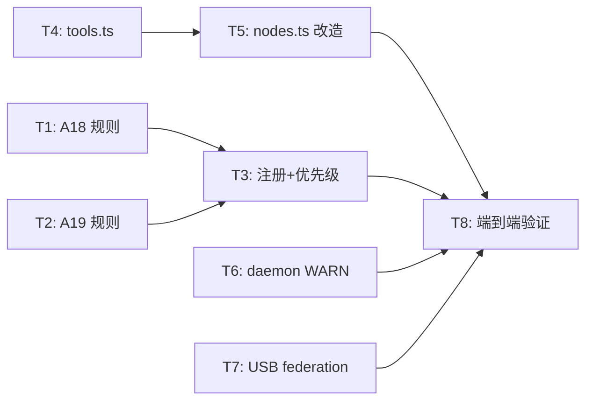

# sofagent v1.1.4 系统架构设计 + 任务分解

> 架构师：高见远 · 2026-07-18  
> 基于 dev prompt + 开发日志 + 现有代码审查

---

## 1. 实现方案确认 / 调整

### 交付一：LOOP 工具注入（P0）—— ✅ 方案可行

**确认结论**：dev prompt 的「路 A」方案与现有代码完全兼容。

**代码依据**：
- `launcher.ts` 已有 `loadDeepAgents()` → `createDeepAgent()` 的调用链（第 213-221 行），v1.1.3 已将 deepagents 提升为正式依赖
- `buildConstrainedSystemPrompt()` 已从 `@sofagent/harness` 导出（launcher.ts 第 204 行），四层加载链已就绪
- `composer.ts` 的 `createDeepAgent({ tools: [] })` 证实 createDeepAgent 接受 `tools` 参数（composer.ts 第 40-44 行）
- `nodes.ts` 的 `defaultRunEngineer` 当前调 `spawnSubAgent`（第 77 行），改造点明确

**无调整**。方案直接落地。

### 交付二：条件路由升级（P1）—— ✅ 方案可行，blocked 写入已有骨架

**确认结论**：
- `routeAfterAudit` 已支持 `PASS/WARN → reviewer`、`FAIL → engineer`（loop-graph.ts 第 79-83 行）——**WARN 路由无需改**
- `defaultRecordBlocked` 已实现 blocked 写入 audit history（nodes.ts 第 192-208 行）——**已就绪**
- WARN 标注在审查报告 header 中追加即可，**改动量极小**

### 交付三：USB federation（P2）—— ✅ 方案可行

**确认结论**：daemon 巡检框架已就绪（`inspectors/index.ts` → `runInspectors`），USB 检测作为独立模块新增，不影响现有巡检器。基础检测（标签+文件存在）不需要第三方 USB 库——用 Node.js `fs` 扫描挂载点 + 读 `federation.json` 即可。

### 交付四：审计闭环加固（P1）—— ✅ 方案可行

**确认结论**：
- A18/A19 规则实现遵循 `Rule` 接口（types.ts 第 67-77 行），与 A17 同构
- `runner.ts` 的 `AUDIT_PRIORITY` 四层分组架构清晰（第 30-35 行），A19 插入 critical 层、A18 插入 extended 层
- `index.ts` 的注册表模式简洁（第 44-53 行），追加 A18/A19 到 extendedRules 数组即可
- daemon WARN 报告复用 `InspectorResult` 接口，新增分析器与 `audit-history-analyzer.ts` 同构

### 交付五：端到端验证（P0）—— ✅ 方案可行

任务依赖交付一~四就绪后执行。

---

## 2. 文件清单

| 文件路径 | 操作 | 说明 |
|:--|:--|:--|
| `orchestrator/src/tools.ts` | 🆕 新增 | 6 个 DeepAgents 工具定义（read/write/edit/bash/search/test），每个 description 内嵌 A1-A17 约束 |
| `orchestrator/src/graph/nodes.ts` | ✏️ 修改 | `defaultRunEngineer` / `defaultRunReviewer` 改为直接 `createDeepAgent` + 注入 tools，加降级标注 |
| `orchestrator/src/index.ts` | ✏️ 修改 | 导出 tools 相关符号 |
| `audit/src/rules/rule-a18-junk-file.ts` | 🆕 新增 | A18 垃圾文件检测规则（能力拐杖，git-diff） |
| `audit/src/rules/rule-a19-commit-msg-quality.ts` | 🆕 新增 | A19 commit message 质量规则（业务底线，git-diff） |
| `audit/src/rules/index.ts` | ✏️ 修改 | 注册 A18/A19 到 extendedRules |
| `audit/src/rules/runner.ts` | ✏️ 修改 | AUDIT_PRIORITY 插入 A19→critical、A18→extended |
| `audit/src/index.ts` | ✏️ 修改 | 导出 A18/A19 check 函数（如需） |
| `daemon/src/inspectors/warn-accumulator.ts` | 🆕 新增 | WARN 累积分析器（扫描 history.jsonl 中 exitCode=1，连续 N≥3 未处理 → 告警） |
| `daemon/src/inspectors/index.ts` | ✏️ 修改 | 注册 warn-accumulator 巡检器 |
| `daemon/src/usb-detect.ts` | 🆕 新增 | USB federation 检测 + 自动配置应用 |
| `daemon/src/cli.ts` | ✏️ 修改 | 新增 `sofa-federation export-usb` CLI 命令入口 |
| `daemon/src/notify.ts` | ✏️ 修改 | WARN 累积报告生成 daemon-notice.md 的入口 |
| `orchestrator/src/__tests__/tools.test.ts` | 🆕 新增 | tools.ts 单元测试 |
| `audit/src/rules/__tests__/rule-a18.test.ts` | 🆕 新增 | A18 规则测试 |
| `audit/src/rules/__tests__/rule-a19.test.ts` | 🆕 新增 | A19 规则测试 |
| `daemon/src/__tests__/warn-accumulator.test.ts` | 🆕 新增 | WARN 累积分析器测试 |
| `daemon/src/__tests__/usb-detect.test.ts` | 🆕 新增 | USB 检测测试 |

---

## 3. 接口契约

### 3.1 A18 规则：`checkRuleA18`

```typescript
// audit/src/rules/rule-a18-junk-file.ts

/**
 * A18 垃圾文件检测（能力拐杖 · extended 层 · git-diff）
 *
 * 检测根目录或非测试目录中新增的临时文件名模式。
 * 命中 → WARN（不阻断）。
 *
 * 模式列表：
 *   - 单字母文件名：^[a-z]\.(txt|md|js|ts)$
 *   - 临时前缀：^(test|tmp|temp|foo|bar|aaa)[0-9]*\.
 *   - 占位名：^(new|old)-name\.
 *
 * 豁免路径：
 *   - test/、tests/、__tests__/（目录前缀）
 *   - *.test.ts、*.spec.ts、*.test.tsx（正规测试文件后缀）
 */
export function checkRuleA18(ctx: AuditContext): RuleCheck;

// 返回 RuleCheck:
// {
//   name: 'A18 垃圾文件',
//   number: 18,
//   status: 'PASS' | 'WARN',        // 不产生 FAIL
//   details: string[],               // 命中时：['新增垃圾文件: a.txt, b.txt（匹配模式: 单字母文件名）']
//   evidenceMode: 'git-diff',
//   ruleClass: '能力拐杖',
// }
```

**实现要点**：
- 检查 `diffFiles` 中所有文件（v1.1.4 审查修正：不区分 status，modified 的垃圾文件被改动也应告警——原设计只看 `status === 'added'` 过于宽松，已存在的垃圾文件被修改同样该告警）
- 豁免检查优先级：路径前缀匹配 → basename 后缀匹配
- details 格式：`检测到 N 个疑似垃圾文件：<file>（命中模式：X）`

### 3.2 A19 规则：`checkRuleA19`

```typescript
// audit/src/rules/rule-a19-commit-msg-quality.ts

/**
 * A19 commit message 质量（业务底线 · critical 层 · git-diff）
 *
 * evidenceMode=git-diff 但实际只读 ctx.commitMsg，不读 diff 内容。
 * 命中 → FAIL（阻断级）。
 *
 * 判定逻辑（任一命中即 FAIL）：
 *   1. message 长度 < 8 字符（含首尾空格后 trim）
 *   2. message 完全匹配黑名单词（大小写不敏感）：
 *      add / fix / test / update / change / wip / tmp / asdf
 *
 * 当 commitMsg 为空或 undefined 时 → PASS（降级，不做判定）
 */
export function checkRuleA19(ctx: AuditContext): RuleCheck;

// 返回 RuleCheck:
// {
//   name: 'A19 msg 质量',
//   number: 19,
//   status: 'PASS' | 'FAIL',
//   details: string[],  // FAIL 时：['commit message 质量不合格: 长度 3 字符（阈值 8）; 命中黑名单词 "add"']
//   evidenceMode: 'git-diff',
//   ruleClass: '业务底线',
// }
```

**实现要点**：
- `ctx.commitMsg` 为空 → 返回 PASS（不阻断，避免无 commit 场景误杀）
- 长度检查：`commitMsg.trim().length < 8`
- 黑名单检查：`BLACKLIST.has(commitMsg.trim().toLowerCase())`
- details 格式：`commit message 质量不合格: <原因1>; <原因2>`

### 3.3 tools.ts 6 个工具（DeepAgents tool 格式）

```typescript
// orchestrator/src/tools.ts

/**
 * DeepAgents 工具标准格式（参考 composer.ts createDeepAgent 调用）
 * 每个工具是一个对象：{ name, description, schema, execute }
 */

/** 工具接口（与 DeepAgents tool 定义对齐） */
export interface LoopTool {
  name: string;
  description: string;
  schema: {
    type: 'object';
    properties: Record<string, { type: string; description: string }>;
    required: string[];
  };
  execute: (args: Record<string, unknown>) => Promise<string>;
}

// ── 工具定义 ──────────────────────────────

/** read_file — 读取文件内容，A7 先读再改的地基 */
export const readFileTool: LoopTool = {
  name: 'read_file',
  description: '读取指定路径的文件内容。修改任何文件前必须先读。约束：A7 不存盲改——未读过的文件不允许直接修改。',
  schema: {
    type: 'object',
    properties: {
      path: { type: 'string', description: '文件路径（相对于工作目录）' },
    },
    required: ['path'],
  },
  execute: async ({ path }) => { /* fs.readFileSync, 返回内容或错误信息 */ },
};

/** write_file — 写入文件，约束：A1 不碰敏感 + A3 不改越界 + A16 非授权 */
export const writeFileTool: LoopTool = {
  name: 'write_file',
  description: '将内容写入文件（覆盖）。约束：A1 不碰敏感（.env/密钥文件禁止写）; A3 只改任务要求的文件; A16 敏感目录变更需授权。',
  schema: {
    type: 'object',
    properties: {
      path: { type: 'string', description: '文件路径' },
      content: { type: 'string', description: '文件内容' },
    },
    required: ['path', 'content'],
  },
  execute: async ({ path, content }) => { /* writeFileSync */ },
};

/** edit_file — 精确替换，约束同 write_file */
export const editFileTool: LoopTool = {
  name: 'edit_file',
  description: '对文件做精确字符串替换。约束：同 write_file。必须先 read_file 确认 old_string 存在。',
  schema: {
    type: 'object',
    properties: {
      path: { type: 'string' },
      old_string: { type: 'string', description: '要替换的原文（必须精确匹配）' },
      new_string: { type: 'string', description: '替换后的内容' },
    },
    required: ['path', 'old_string', 'new_string'],
  },
  execute: async ({ path, old_string, new_string }) => { /* read → replace → write */ },
};

/** run_bash — 执行 shell 命令，约束：A6 不坏构建 + A11 不滥资源 */
export const runBashTool: LoopTool = {
  name: 'run_bash',
  description: '执行 shell 命令。约束：A6 不坏构建（禁止 rm -rf / 删 package.json）; A11 不滥资源（禁止无限循环/大量 fork）。',
  schema: {
    type: 'object',
    properties: {
      command: { type: 'string', description: '要执行的命令' },
      cwd: { type: 'string', description: '工作目录（可选）' },
    },
    required: ['command'],
  },
  execute: async ({ command, cwd }) => { /* execSync with timeout */ },
};

/** search_code — 文件搜索 / 内容搜索 */
export const searchCodeTool: LoopTool = {
  name: 'search_code',
  description: '搜索文件或文件内容。支持 glob 文件名模式或正则内容搜索。',
  schema: {
    type: 'object',
    properties: {
      pattern: { type: 'string', description: '搜索模式（glob 或正则）' },
      type: { type: 'string', enum: ['filename', 'content'], description: '搜索类型' },
      path: { type: 'string', description: '搜索目录（可选，默认当前目录）' },
    },
    required: ['pattern', 'type'],
  },
  execute: async ({ pattern, type, path }) => { /* glob 或 grep */ },
};

/** run_test — 运行测试，约束：A8 不逃验证 */
export const runTestTool: LoopTool = {
  name: 'run_test',
  description: '运行项目测试。约束：A8 不逃验证——变更后必须运行测试确认无回归。',
  schema: {
    type: 'object',
    properties: {
      command: { type: 'string', description: '测试命令（可选，默认 npm test）' },
    },
    required: [],
  },
  execute: async ({ command }) => { /* execSync(npm test) */ },
};

// ── 工具集导出 ──────────────────────────────

/** engineer 节点完整工具集 */
export const ENGINEER_TOOLS: LoopTool[] = [
  readFileTool, writeFileTool, editFileTool,
  runBashTool, searchCodeTool, runTestTool,
];

/** reviewer 节点审查专用工具子集（只读 + 搜索 + 测试，不能写） */
export const REVIEWER_TOOLS: LoopTool[] = [
  readFileTool, searchCodeTool, runTestTool,
];

/** 将 LoopTool[] 转为 DeepAgents createDeepAgent 所需格式 */
export function toDeepAgentsTools(tools: LoopTool[]): unknown[] {
  return tools.map(t => ({
    name: t.name,
    description: t.description,
    schema: t.schema,
    execute: t.execute,
  }));
}
```

### 3.4 USB federation

```typescript
// daemon/src/usb-detect.ts

/** USB 设备信息 */
export interface USBDevice {
  mountPath: string;      // 挂载路径，如 /Volumes/SOFAGENT
  label: string;          // 卷标
  hasFederation: boolean; // 是否含 federation.json
}

/**
 * 检测所有挂载的、标签为 SOFAGENT 的 USB 设备。
 * 跨平台策略：
 *   - macOS: 扫描 /Volumes/ 目录下卷标为 SOFAGENT 的子目录
 *   - Linux: 读取 /proc/mounts 找 SOFAGENT 标签
 *   - Windows: 检查可用盘符下的 SOFAGENT 标签
 *
 * 基础检测模式：只看标签 + federation.json 是否存在，不做签名校验。
 */
export function detectUSB(): USBDevice[];

/**
 * 从 USB 设备读取联邦配置。
 * federation.json 结构：
 * {
 *   "version": 1,
 *   "nodes": [{ "id": "...", "role": "...", "config": {...} }],
 *   "policies": [{ "name": "...", "rules": [...] }],
 *   "createdAt": "ISO8601",
 *   "createdBy": "fde-name"
 * }
 */
export function readFederation(device: USBDevice): FederationConfig | null;

/**
 * 将联邦配置应用到本地 ~/.sofagent/
 * - nodes → ~/.sofagent/orchestrator/nodes/
 * - policies → ~/.sofagent/audit/policies/
 * - 写入后返回需要重启的标志
 */
export function applyFederation(config: FederationConfig): Promise<boolean>;

/**
 * 将当前节点的配置导出到 USB 设备（CLI export-usb 命令调用）
 */
export function exportToUSB(mountPath: string): Promise<{ success: boolean; message: string }>;

/** 联邦配置结构 */
export interface FederationConfig {
  version: number;
  nodes: Array<{ id: string; role: string; config: Record<string, unknown> }>;
  policies: Array<{ name: string; rules: string[] }>;
  createdAt: string;
  createdBy: string;
}
```

### 3.5 WARN 累积报告（基于 InspectorResult）

```typescript
// daemon/src/inspectors/warn-accumulator.ts

/**
 * WARN 累积分析器——扫描 history.jsonl 中 exitCode=1（WARN）的记录。
 *
 * 判定逻辑：
 *   1. 加载最近 N 条历史（默认 limit=100）
 *   2. 筛选 exitCode === 1 的条目
 *   3. 按连续性判断："后续 commit 没有清理动作" = WARN 之后没有对应文件的删除 commit
 *   4. 连续 ≥ 3 条 WARN 未处理 → triggered=true, severity='warning'
 *
 * 输出 message 格式：
 *   "WARN 累积告警：最近 {N} 条审计中 {M} 条 WARN 未处理，涉及文件: {fileList}"
 */
export function analyzeWarnAccumulation(projectDir: string): InspectorResult;

// 复用现有 InspectorResult:
// {
//   name: 'warn-accumulator',
//   triggered: true | false,
//   message: string,
//   severity: 'info' | 'warning',
// }
```

**与 `audit-history-analyzer.ts` 的区别**：
- `audit-history-analyzer`：检查「同一规则 7 天内重复 ≥3 次」（规则级别）
- `warn-accumulator`：检查「连续 WARN 记录未处理」（告警累积级别）

### 3.6 blocked 终态写入 history（已有骨架）

```typescript
// 复用现有 AuditHistoryEntry（audit-history.ts 第 55-78 行），无需新增字段
// defaultRecordBlocked 已实现（nodes.ts 第 192-208 行），写入时：
// {
//   timestamp: new Date().toISOString(),
//   diffRange: 'loop-graph',
//   task: `[LOOP blocked] ${state.artifacts.task}`.slice(0, 500),
//   exitCode: 2,                     // ← FAIL 级别
//   ruleResults: [],                 // ← blocked 时无规则结果
//   diffFileCount: 0,
//   commitMsg: `checkpointId=${state.checkpointId} retryCount=${state.retryCount}`,
//   engine: 'loop-graph',
// }

// v1.1.4 补充：WARN 标注也需要写入 history——audit 节点 WARN 判定时追加记录
// 在 defaultRunAudit 中，verdict='WARN' 时也调用 appendHistory
```

---

## 4. 任务列表

| ID | 任务名 | 涉及文件 | 依赖 | 难度 | 优先级 | 实现顺序理由 |
|:--|:--|:--|:--|:--|:--|:--|
| **T1** | A18 垃圾文件检测规则 | `audit/src/rules/rule-a18-junk-file.ts` 🆕, `audit/src/rules/__tests__/rule-a18.test.ts` 🆕 | — | ★★☆ | P0 | 独立模块，不依赖任何其他 v1.1.4 交付项。与 T2 并行。先做规则实现再注册。 |
| **T2** | A19 commit message 质量规则 | `audit/src/rules/rule-a19-commit-msg-quality.ts` 🆕, `audit/src/rules/__tests__/rule-a19.test.ts` 🆕 | — | ★☆☆ | P0 | 独立模块，逻辑最简单（长度+黑名单检查）。与 T1 并行。 |
| **T3** | A18/A19 注册 + 优先级插入 | `audit/src/rules/index.ts` ✏️, `audit/src/rules/runner.ts` ✏️, `audit/src/index.ts` ✏️ | T1, T2 | ★☆☆ | P0 | 依赖 T1/T2 的 check 函数就绪后才能注册。优先级数组改动点明确。 |
| **T4** | tools.ts 6 个工具定义 | `orchestrator/src/tools.ts` 🆕, `orchestrator/src/__tests__/tools.test.ts` 🆕, `orchestrator/src/index.ts` ✏️ | — | ★★☆ | P0 | 独立模块，只需 Node.js fs/execSync。tools 是 nodes.ts 改造的前置依赖，所以放在 nodes.ts 之前。 |
| **T5** | nodes.ts 改造：工具注入 + 降级 | `orchestrator/src/graph/nodes.ts` ✏️ | T4 | ★★★ | P0 | 核心改动——defaultRunEngineer/defaultRunReviewer 从 spawnSubAgent 切换为 createDeepAgent + tools。降级路径需保留。难度最高。 |
| **T6** | daemon WARN 累积报告 | `daemon/src/inspectors/warn-accumulator.ts` 🆕, `daemon/src/inspectors/index.ts` ✏️, `daemon/src/__tests__/warn-accumulator.test.ts` 🆕 | — | ★★☆ | P1 | 独立于 LOOP 工具链。复用 InspectorResult 接口和 audit-history-analyzer 的模式。与 T7/T8 并行。 |
| **T7** | USB federation | `daemon/src/usb-detect.ts` 🆕, `daemon/src/cli.ts` ✏️, `daemon/src/__tests__/usb-detect.test.ts` 🆕 | — | ★★★ | P2 | 独立功能。跨平台检测逻辑复杂。基础检测模式降低难度。 |
| **T8** | 端到端验证 + 条件路由收尾 | `orchestrator/src/graph/nodes.ts` ✏️ (WARN 标注), 文档验证记录 | T1-T7 | ★☆☆ | P0 | 所有功能就绪后的集成验证。WARN 标注改动量极小（audit report header 加一行）。 |

### 任务依赖图



---

## 5. 数据流图（Mermaid 时序图）

```mermaid
sequenceDiagram
    participant U as 用户/CLI
    participant G as LOOP StateGraph
    participant E as engineer 节点
    participant T as tools.ts (6工具)
    participant DA as DeepAgents
    participant A as audit 节点
    participant AR as Audit Runner (A1-A19)
    participant R as reviewer 节点
    participant H as human_confirm
    participant HP as history.jsonl

    U->>G: runLoopGraph(task)
    G->>E: makeEngineerNode

    Note over E,T,DA: 工具注入（v1.1.4 核心变更）
    E->>T: toDeepAgentsTools(ENGINEER_TOOLS)
    T-->>E: [read_file, write_file, edit_file, run_bash, search_code, run_test]
    E->>DA: createDeepAgent({ tools, systemPrompt, maxTurns: 20 })

    Note over E,DA: engineer 执行任务
    E->>T: read_file(SECURITY.md)
    T-->>E: 文件内容
    E->>T: edit_file(SECURITY.md, old, new)
    T-->>E: 编辑成功
    E->>DA: agent.invoke(task)
    DA-->>E: 产出摘要（diff 描述）
    E-->>G: { engineerOutput }

    G->>A: makeAuditNode
    A->>AR: runRules(diffFiles, [], task, false, true)
    Note over AR: critical: A1→A2→A9→A4→A19
    Note over AR: warning: A3→A5→A6→A10→A11
    Note over AR: crutch: A7→A8
    Note over AR: extended: A14→A15→A16→A17→A18→E1-E4

    alt A19 FAIL (message 不合格)
        AR-->>A: exitCode=2 (FAIL: A19)
        A->>HP: appendHistory (FAIL 记录)
        A-->>G: { verdict: FAIL, report }
        G-->>G: retryCount < 3 → 回 engineer
    else A18 WARN (垃圾文件)
        AR-->>A: exitCode=1 (WARN: A18)
        A->>HP: appendHistory (WARN 记录)
        A-->>G: { verdict: WARN, report: "⚠️ 降级运行标注" }
        G-->>R: PASS/WARN → reviewer
    else 全部 PASS
        AR-->>A: exitCode=0
        A-->>G: { verdict: PASS, report }
        G-->>R: PASS → reviewer
    end

    Note over R: reviewer 工具注入（只读子集）
    R->>T: toDeepAgentsTools(REVIEWER_TOOLS)
    T-->>R: [read_file, search_code, run_test]
    R->>DA: createDeepAgent({ tools, REVIEWER_AGENT })
    R-->>G: { reviewReport }

    G->>H: makeHumanConfirmNode
    H->>U: 展示审查报告 + WARN 标注
    U-->>H: y / n

    alt y (确认通过)
        H-->>G: { finalStatus: completed }
    else n 且 retryCount < 3
        H-->>G: { retryCount++ → 回 engineer }
    else n 且 retryCount ≥ 3
        H-->>G: { finalStatus: blocked }
        G->>HP: appendHistory (blocked 记录)
    end

    G-->>U: LoopGraphResult { finalStatus }
```

---

## 6. 共享知识 / 跨文件约定

### 6.1 A18/A19 的 ruleClass 决定 AUDIT_PRIORITY 位置

```
AUDIT_PRIORITY（v1.1.4 最终形态）:
  critical: ['A1', 'A2', 'A9', 'A4', 'A19']     ← A19 插入末尾（A4 之后，A3 之前）
  warning:  ['A3', 'A5', 'A6', 'A10', 'A11']     ← 不变
  crutch:   ['A7', 'A8']                          ← 不变
  extended: ['A14', 'A15', 'A16', 'A17', 'A18', 'E1', 'E2', 'E3', 'E4']
                                                    ↑ A18 插入 A17 之后、E1 之前
```

- **A19 为什么排 A4 之后**：A4 检测 `.sofagent` config 删除（最危险），A19 检测 message 质量（次危险），A19 FAIL 后 A3 越界检测无需跑。
- **A18 为什么排 A17 之后**：A 组核心扩展按编号正序（A14→A15→A16→A17→A18），E 组工程规范排后。

### 6.2 evidenceMode 约定

| 规则 | evidenceMode | 实际读取来源 |
|:--|:--|:--|
| A18 | `git-diff` | `ctx.diffFiles[].path`（只看 diff 文件名） |
| A19 | `git-diff` | `ctx.commitMsg`（只看 commit message，不读 diff 内容） |

> 注意：A19 的 evidenceMode 标注为 `git-diff`（与其他 critical 层规则一致），但实现上只读 `ctx.commitMsg`，不遍历 diff 行。

### 6.3 tools.ts 工具错误处理

```typescript
// 约定：所有工具 execute 失败时返回错误字符串，不 throw
// 格式：`[ERROR] <工具名>: <错误信息>`
// 例：`[ERROR] read_file: 文件不存在 /path/to/file`

// engineer/reviewer 通过 description 中的约束感知边界，
// 工具本身不做约束拦截（约束拦截留给 audit 节点 + git commit hook）。
```

### 6.4 降级标注双层机制

```
1. audit report header：
   "⚠️ 降级运行标注：审计引擎不可用，已降级为 WARN 判定。由 reviewer 与人工确认兜底。"

2. daemon notice（WARN 累积报告）：
   当 history.jsonl 中出现 engine='loop-graph' 且 exitCode=1 的记录时，
   daemon-notice.md 追加："检测到 LOOP 降级运行记录，请检查 deepagents 可用性。"
```

### 6.5 reviewer 工具子集约定

```typescript
// reviewer 不能写文件——只读 + 搜索 + 测试
// REVIEWER_TOOLS = [readFileTool, searchCodeTool, runTestTool]
// engineer = 全部 6 个工具
// 这确保 reviewer 的审查基于实际代码/测试结果，而非"看起来对"
```

### 6.6 maxTurns 约定

```typescript
// createDeepAgent({ ..., maxTurns: 20 })
// PRD Q1 决策：先按 20 发布
// 超过 20 轮 → DeepAgents 自动停止，返回当前产出
// engineer 重试上限 = DEFAULT_MAX_RETRIES = 3（nodes.ts 第 23 行）
```

---

## 7. 待明确事项

### 7.1 USB federation 的 `federation.json` 结构

dev prompt 描述了"自动读取 federation.json → 写入 ~/.sofagent/"，但未定义 `federation.json` 的字段结构。**假设如下**（需 PM 确认）：

```json
{
  "version": 1,
  "nodes": [{ "id": "node-001", "role": "audit", "config": { ... } }],
  "policies": [{ "name": "strict-audit", "rules": ["A1", "A2"] }],
  "createdAt": "2026-07-18T10:00:00Z",
  "createdBy": "fde-qi"
}
```

### 7.2 tools.ts 工具的 CWD（工作目录）

tools.ts 中的 `read_file` / `write_file` 等工具的文件路径基准——是 `process.cwd()` 还是 `.sofagent` 配置中的项目路径？**假设**：以 `process.cwd()` 为基准（与现有 `spawnSubAgent` 行为一致），dev prompt 未明确指定。

### 7.3 A18 豁免路径是否需要可配置

dev prompt 列了固定豁免路径（test/、tests/、__tests__/、*.test.ts）。**当前假设**：硬编码豁免，不走 `ctx.config`。如果后续需要可配置，可扩展 AuditConfig 增加 `a18_exempt_paths` 字段。

### 7.4 WARN 累积报告的"未处理"判定逻辑

"连续 N 条 WARN 未处理"中的"未处理"如何判定？dev prompt 说"后续 commit 没有清理动作"。**当前假设**：检查 WARN 记录涉及的文件，在后续 history 记录中是否有对应文件的删除（diffFileCount 减少）。这需要解析 ruleResults 中的 details 提取文件名——**实现复杂度较高，建议 v1.1.4 先做简单版（连续 ≥3 条 exitCode=1 即告警），v1.1.5 做精确的文件级追踪**。

### 7.5 A18 检测的文件范围

A18 检测"根目录或非测试目录"的垃圾文件——具体是只看 `diffFiles` 中新增的文件，还是也扫描工作区？**当前假设**：只看 `diffFiles`（evidenceMode=git-diff 的语义），不扫描工作区（那是 A17 filesystem 模式的职责）。
