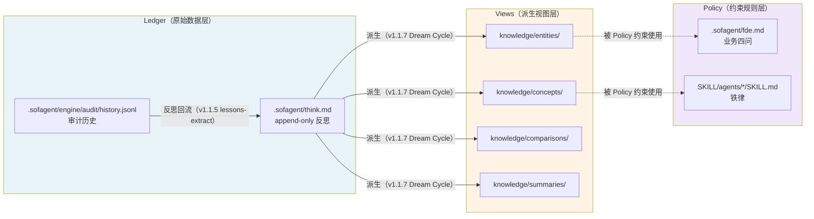

# LLM Wiki 三层范式 ↔ sofagent 三层治理映射

> v1.2.0 · 孔放勋 · 2026-07-24（UTC）

本文档把 LLM Wiki 的「raw materials → Wiki entries → spec norms」三层范式与 sofagent 的「Ledger-Views-Policy」三层治理模型做**同构对照**。

**注意**：本文档**不重新定义三层**。Ledger-Views-Policy 的唯一权威文字定义在 [PHILOSOPHY.md §五](./PHILOSOPHY.md)（L168-181），代码级契约在 `engine/core/src/memory-contract.ts`，架构映射声明在 [ARCHITECTURE.md L346/L348](./ARCHITECTURE.md)。本表只做映射，不做定义。

---

## 一、同构对照表

| LLM Wiki 层 | sofagent 对应 | 物理位置 | 读 | 写 | 审计 |
|------|------|------|------|------|------|
| **raw materials** | **Ledger** | `.sofagent/think.md` + `.sofagent/engine/audit/history.jsonl` | Agent + 审计引擎 | Agent 实时写入（append-only，`memory-contract.ts` 强制） | audit 引擎每次 commit |
| **Wiki entries** | **Views** | `.sofagent/knowledge/{entities,concepts,comparisons,summaries}/` | Agent + MCP tools（`read_entity` / `read_concept` / `list_entities` / `search_knowledge`） | Dream Cycle 派生（v1.1.7 落地；v1.1.6 只检测不生产） | daemon `conflict-check`（矛盾/孤儿/死链） |
| **spec norms** | **Policy** | `.sofagent/fde.md` + `SKILL/agents/*/SKILL.md` | Agent 启动时经 Harness 加载链注入 | 人 + FDE 维护（手动 / sustain 模式） | A15 约束验证规则 |

> ⚠️ **Views 层是 4 个子目录**：`entities/` `concepts/` `comparisons/` `summaries/`。此前部分文档只列 3 个（漏 summaries），v1.1.6 起统一为 4 个，与 MCP server（`engine/mcp/src/mcp-server.ts` L789/972/994/999）的实际规范对齐。

---

## 二、数据流图（单向派生）

PHILOSOPHY.md §五 L181 明确：「派生方向严格单向：think.md（Ledger）→ knowledge/（Views）」。本图用文档已有的「派生」动词，不引入新术语：

**派生方向铁律**：
- ✅ Ledger → Views：合法（Dream Cycle / lessons-extract）
- ✅ Ledger → Ledger（append-only）：合法（`appendThinkEntry()`）
- ❌ Views → Ledger：**禁止反向写回**（`memory-contract.ts` 代码级强制）
- ❌ 任何层 → 历史条目覆写：**禁止**（append-only 不变量）

---

## 三、每层对 sofagent 现有引擎的调用关系

| 层 | 主要读取方 | 主要写入方 | 审计/巡检方 | 现有引擎 |
|------|------|------|------|------|
| **Ledger** | 编排引擎 / daemon（lessons-extract）/ Harness 加载链 / 人类 | 审计引擎（git diff 自动反思）+ 主 Agent（write_think）+ FDE/loop 陪跑 | **audit 引擎**（每次 commit 跑 21 条规则） | `@sofagent/audit` · `@sofagent/core`（memory-contract） |
| **Views** | Agent + MCP tools（`@sofagent/mcp` 7 个 knowledge tool） | **v1.1.6：人工 + Agent 手动**；**v1.1.7：Dream Cycle 自动派生** | **daemon 巡检**（`conflict-check` 矛盾/孤儿/死链 · `knowledge-freshness` 新鲜度） | `@sofagent/daemon`（conflict-check.ts）· `@sofagent/mcp` |
| **Policy** | Agent 启动时经 Harness 加载链注入（fde.md → SKILL.md → 运行时上下文） | 人 + FDE 维护（deploy 初次建 + sustain 每周迭代） | **A15 约束验证**（Agent 是否违反 SKILL 铁律） | `@sofagent/audit`（rule A15）· `@sofagent/harness`（加载链） |

---

## 四、与 v1.1.7（Dream Cycle）的衔接

| 维度 | v1.1.7（本版本） | v1.1.8（下一版） |
|------|------|------|
| **核心动作** | **检测**：发现 Views 层健康问题（矛盾/孤儿/死链） | **生产**：Dream Cycle 6 阶段管道自动从 Ledger 派生 Views |
| **knowledge/ 内容来源** | 人工 + Agent 手动写入 | fact → atom → cluster → synthesize → skillopt → embed 自动派生 |
| **conflict-check 角色** | 上线，对人工写入的 knowledge 做底线巡检 | 升级为 Dream Cycle 输出的「守门员」——派生后立即跑一遍 |
| **sensitivity 字段** | 不做 | 加 `public/internal/restricted` 三级，与 conflict-check 联动 |
| **新增 inspector** | `conflict-check`（@weekly） | 可能新增 `dream-cycle-health`（管道运行状态） |

**v1.1.6 的边界**：
- ✅ 做：检测矛盾/孤儿/死链，输出 `InspectorResult`，fail-closed 只读
- ❌ 不做：自动修复矛盾、自动清理孤儿、自动补 index.md 行——**修复永远留给 Agent + 人**
- ❌ 不做：Dream Cycle 管道、知识派生、sensitivity 字段、加密层

---

## 五、为什么这样分层

| LLM Wiki 的设计意图 | sofagent 的对应实现 |
|------|------|
| raw materials 必须可追溯、不可篡改 | think.md append-only，`memory-contract.ts` 代码级强制；audit history 环境指纹防篡改（hashVersion: 2） |
| Wiki entries 是加工品，应可重建 | knowledge/ 全部可从 think.md 派生重建（v1.1.7 Dream Cycle 落地）；conflict-check 保证派生质量 |
| spec norms 是人类意志的最后防线 | fde.md 业务四问由人写、A15 由代码强制；SKILL.md 铁律是 Agent 启动时注入的硬约束 |

---

## 六、相关链接

- [PHILOSOPHY.md §五 · Ledger-Views-Policy 权威定义](./PHILOSOPHY.md)
- [ARCHITECTURE.md · 文件系统架构三层映射声明](./ARCHITECTURE.md)
- [memory-contract.ts · think.md 契约代码级 SSOT](../engine/core/src/memory-contract.ts)
- [ROADMAP.md v1.1.6 行](../ROADMAP.md)
- [docs/changelog/v1.1.6.md](./changelog/v1.1/v1.1.6.md)

## 七、知识库作为 Agent 可信调用载体（2026-07 研报印证）

企业知识库正从「问答工具」升级为「Agent 可信调用载体」——研报的 4 道关卡模型可直接映射到 LLM Wiki 三层：

| 研报关卡 | 对应 LLM Wiki 层 | sofagent 落点 |
|----------|----------------|--------------|
| 数据入口（权限**实时回连**核验，不静态拷贝） | Ledger（append-only 真相源） | FDE 知识主权归客户 + 审计 A14 事后审计 |
| 内容解析（多模态结构化） | Ledger → Views 派生 | Dream Cycle 自动派生 |
| 复杂检索（先规划再分步检索，动态判充足度） | Views（按需查询） | conflict-check 质量巡检 |
| 工具网关（统一受控入口：身份·路由·重试·审计） | Policy（约束注入） | MCP 桥 + 审计引擎 |

**可信工具 4 要求**（可溯源 / 权限合规 / 过程可查 / 证据可验）即 LLM Wiki「spec norms 是人类意志最后防线」的工程化表达——Policy 层 = 受控调用，审计引擎 = 证据可验，二者同构。

> 📖 来源：温故知新 2026-07-21（行业研报《企业知识库进阶：从问答工具到 Agent 可信调用载体》）
