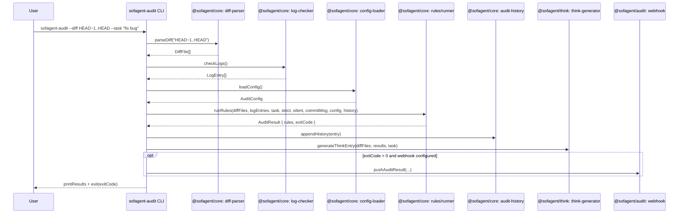
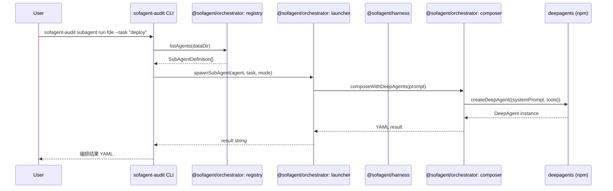
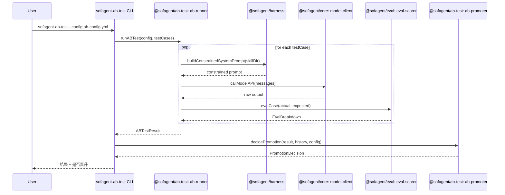
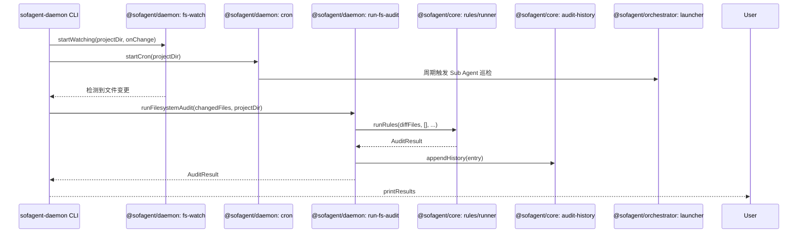
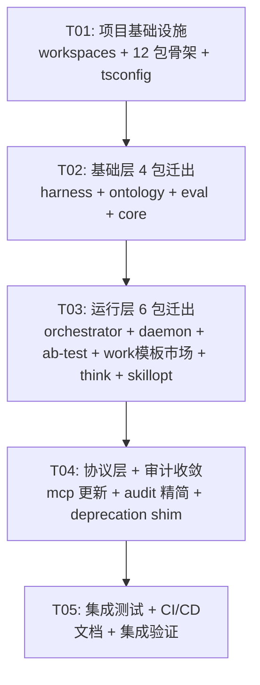

# sofagent v1.1.0 架构重构 — 11 包拆分设计

> **作者**: Bob (Architect)
> **日期**: 2025-07-14
> **状态**: 设计阶段 — 只设计不改代码

---

## Part A: System Design

### 1. Implementation Approach

#### 核心技术挑战

| 挑战 | 描述 | 对策 |
|------|------|------|
| **上帝入口拆分** | `index.ts` 集中 dispatch 了所有子命令（17 个动态 import），每个 import 都是一个跨包依赖 | 每个新包自带 CLI bin 入口，老 `sofagent-audit` 变为 deprecation shim + 转发层 |
| **四层约束加载链迁移** | `buildConstrainedSystemPrompt()` 定义在 launcher.ts，但被 ab-runner.ts、orchestrator 等多个模块消费 | 将其提升为独立基础包 `@sofagent/harness`，零外部依赖 |
| **跨包类型复用** | `DiffFile`, `AuditResult`, `RuleCheck`, `EvalBreakdown` 等被多个未来包消费 | 在 `@sofagent/core` 中集中定义并 re-export |
| **bin 字段爆炸** | 当前 audit/package.json 有 9 个 bin 条目，拆分后每个包各自管理自己的 bin | 每个新包独立管理 `bin` 字段 |
| **mcp → audit 外部依赖** | mcp-server.ts 通过 `@sofagent/audit` 外部包导入，拆分后 audit 缩减，mcp 需更新依赖 | mcp 改为依赖 `@sofagent/audit`（审计规则）+ `@sofagent/orchestrator`（compose）+ `@sofagent/core`（基础工具） |

#### 框架和库选择

| 选择 | 理由 |
|------|------|
| **保持 TypeScript + Node.js 内置模块为主** | 当前代码风格一致，最小运行时依赖 |
| **js-yaml** | 已经是唯一外部解析依赖，跨包共享 |
| **deepagents** | 保持在 orchestrator 包中，不扩散到其他包 |
| **isomorphic-git** | 保持在 core（diff-parser fallback），不扩散 |
| **npm workspaces** | 已使用，扩展为 13 个 workspace（12 新包 + 保留 mcp） |

#### 架构模式

- **分层架构（Layer Architecture）**: 基础层 → 运行层 → 协议层，严格单向依赖
- **每个包独立 bin**: 各自的 CLI 入口，不通过上帝入口 dispatch
- **公共类型集中在 core**: 避免循环依赖，所有包从 `@sofagent/core` 导入共享类型

---

### 2. File List

```
# === 基础层 4 包（叶子，不依赖任何 sofagent 包）===

# @sofagent/harness
sofagent/harness/
├── package.json
├── tsconfig.json
└── src/
    └── index.ts                          # buildConstrainedSystemPrompt() + tryRead/listKnowledgeTopN

# @sofagent/ontology
sofagent/ontology/
├── package.json
├── tsconfig.json
└── src/
    ├── index.ts                          # barrel export
    ├── types.ts                          # OntologyObject, OntologyAction, OntologyConstraint, MergedOntology
    ├── merge-engine.ts                   # mergeOntology(), checkOntologyStatus()
    └── ontology-view.ts                  # generateOntologyView()

# @sofagent/eval
sofagent/eval/
├── package.json
├── tsconfig.json
└── src/
    ├── index.ts                          # barrel export
    ├── types.ts                          # TestCase, TestCaseResult, EvalBreakdown, EvalResult, EvalConfig
    ├── eval-scorer.ts                    # evalCase()
    ├── eval-runner.ts                    # runEval()
    └── eval-reporter.ts                  # generateEvalReport(), printEvalReport()

# @sofagent/core
sofagent/core/
├── package.json
├── tsconfig.json
└── src/
    ├── index.ts                          # barrel export
    ├── constants.ts                      # VERSION (共享 SSOT)
    ├── diff-parser.ts                    # parseDiff, parseStagedDiff, isInGitRepo, DiffFile, getAddedLines, getRemovedLines, parseNumstat
    ├── log-checker.ts                    # checkLogs, LogEntry
    ├── log-reader.ts                     # log 读取工具
    ├── audit-history.ts                  # loadHistory, appendHistory, clearHistory, checkHistoryChainIntegrity, AuditHistoryEntry
    ├── config-loader.ts                  # loadConfig, safeDefaults, writeConfig, AuditConfig, ConfigLoadError, SofaEnvConfig, loadEnvConfig
    ├── config-template.ts                # CONFIG_TEMPLATE, HOOK_TEMPLATE
    ├── config/watch-config.ts            # loadWatchConfig, WatchConfig, CronJob, DEFAULT_WATCH_CONFIG
    ├── model-client.ts                   # callModelAPI, ModelMessage, ModelCallOptions
    ├── reporter.ts                       # runRules (thin wrapper → rules/runner), AuditResult
    ├── rules/
    │   ├── index.ts                      # defaultRules, rules
    │   ├── types.ts                      # Rule, RuleCheck, AuditContext
    │   ├── runner.ts                     # runRules (fast-fail), AUDIT_PRIORITY
    │   └── ... (A1-A17 + E1-E4 rule implementations)
    ├── verify.ts                         # sofagent-verify CLI 入口
    ├── verify/                           # verify 子模块
    ├── verify-evidence.ts                # verify-evidence CLI
    ├── env-check.ts                      # sofagent-env-check CLI
    ├── diff-ref.ts                       # resolveDiffEndpoint
    ├── cost-baseline.ts                  # calculateBaseline, isAnomaly, isColdStart
    ├── config-suggestion.ts              # formatSuggestions
    ├── audit-root-cause.ts               # analyzeRootCause
    ├── audit-regression.ts               # runRegression, DiffSnapshot
    ├── compress-memory.ts                # memory 压缩
    ├── fix-suggestions.ts                # getFixSuggestion
    ├── shared/
    │   └── atomic-write.ts               # atomicWriteSync, atomicAppendSync
    ├── filesystem/
    │   ├── memory-sync.ts                # getPersonaContent
    │   └── isomorphic-git.ts             # generateDiff
    ├── hitl/                             # HITL 子模块
    └── utils/                            # (当前为空目录，预留)

# === 运行层 6 包（单向依赖基础层或彼此）===

# @sofagent/orchestrator
sofagent/orchestrator/
├── package.json
├── tsconfig.json
└── src/
    ├── index.ts                          # barrel export
    ├── composer.ts                       # composeWithDeepAgents()
    ├── launcher.ts                       # launch, shutdown, spawnSubAgent, readRuntimeState, writeRuntimeState
    ├── registry.ts                       # loadDefinition, listAgents, SubAgentDefinition
    ├── builtin-agents.ts                 # FDE_AGENT, AUDIT_AGENT, BUILTIN_AGENTS
    ├── audit-sub-agent.ts                # readAuditHistory, analyzeCostBaseline, generateAuditReport
    └── orchestrator-compare.ts           # A/B compare + promote + compose CLI (bin)

# @sofagent/daemon
sofagent/daemon/
├── package.json
├── tsconfig.json
└── src/
    ├── index.ts                          # barrel export
    ├── cron.ts                           # startCron()
    ├── fs-watch.ts                       # startWatching()
    ├── run-fs-audit.ts                   # runFilesystemAudit()
    ├── snapshot.ts                       # listAllSnapshots, restoreSnapshot
    └── daemon-cli.ts                     # bin: sofagent-daemon

# @sofagent/ab-test
sofagent/ab-test/
├── package.json
├── tsconfig.json
└── src/
    ├── index.ts                          # barrel export
    ├── types.ts                          # ABConfig, ABTestResult, PromotionDecision, ScoreWeights, DEFAULT_SCORE_WEIGHTS
    ├── ab-runner.ts                      # runABTest()
    ├── ab-promoter.ts                    # decidePromotion()
    └── ab-cli.ts                         # bin: sofagent-ab-test

# @sofagent/work模板市场
sofagent/work模板市场/
├── package.json
├── tsconfig.json
└── src/
    ├── index.ts                          # barrel export
    ├── hub.ts                            # listHubTemplates, hubDeploy
    └── hub-cli.ts                        # bin: sofagent-work模板市场

# @sofagent/think
sofagent/think/
├── package.json
├── tsconfig.json
└── src/
    ├── index.ts                          # barrel export
    ├── think-generator.ts                # generateThinkEntry(), ThinkEntryOptions
    └── think-cli.ts                      # bin: sofagent-think

# @sofagent/skillopt
sofagent/skillopt/
├── package.json
├── tsconfig.json
└── src/
    ├── index.ts                          # barrel export
    ├── skill-safety-check.ts             # scanSkillSafety() + CLI 入口
    ├── skillopt-integration.ts           # runSkillOpt, validateCandidate, isSkillOptAvailable
    ├── rules/
    │   ├── skill-safety-rules.ts         # SafetyResult, SafetyHit, SafetyRule, VERSION
    │   ├── skill-safety-engine.ts        # findFiles, scanFile
    │   └── skill-safety-reporter.ts      # printFileResult, printTerminalSummary, printJsonOutput, printQuietOutput, printError, showHelp
    └── skillopt-cli.ts                   # bin: sofagent-skillopt

# === 协议层 ===

# @sofagent/mcp (已存在，更新依赖)
sofagent/mcp/
├── package.json                          # 更新 dependencies
├── tsconfig.json
└── src/
    └── mcp-server.ts                     # 更新 import: @sofagent/audit → 拆分后的各包

# === 纯审计（叶子，只被依赖）===

# @sofagent/audit (精简后)
sofagent/audit/
├── package.json                          # 更新 bin 字段，更新 dependencies
├── tsconfig.json
└── src/
    ├── index.ts                          # 精简版 CLI: deprecation shim + 核心审计入口
    ├── webhook.ts                        # pushAuditResult, WebhookPlatform
    └── commands/
        ├── init.ts                       # runInit, ensureGitignore
        └── doctor.ts                     # runDoctor, runAgentDashboard
```

---

### 3. Data Structures and Interfaces

```mermaid
classDiagram
    direction TB

    %% ── 基础层 ──
    class Harness {
        +buildConstrainedSystemPrompt(skillDir: string): string
        -tryRead(filePath: string): string | null
        -listKnowledgeTopN(dir: string, n: number): string[]
    }

    class OntologyTypes {
        <<interface>>
        +OntologyObject: name, type, relations, source
        +OntologyAction: name, nodeId, description?, constraints?, source
        +OntologyConstraint: type, target, rule, severity, source
        +MergedOntology: mergedAt, version, objects[], actions[], constraints[], stats
    }

    class OntologyMergeEngine {
        +mergeOntology(configDir: string): MergedOntology
        +checkOntologyStatus(configDir: string): OntologyStatus
    }

    class OntologyView {
        +generateOntologyView(projectDir: string): string
    }

    class EvalTypes {
        <<interface>>
        +TestCase: id, description, input, expected, tags?, allowedTools?
        +EvalBreakdown: exactMatch, semanticSimilarity, ruleCompliance, overall
        +EvalResult: total, passed, failed, passRate, results[], duration
        +EvalConfig: goldenSetPath, verbose?
    }

    class EvalScorer {
        +evalCase(actual: Record, expected: Record): EvalBreakdown
    }

    class EvalRunner {
        +runEval(config: EvalConfig, runFunction?): Promise~EvalResult~
    }

    class EvalReporter {
        +generateEvalReport(result: EvalResult): string
        +printEvalReport(result: EvalResult): void
    }

    class CoreTypes {
        <<interface>>
        +DiffFile: path, status, oldPath?, lines[]
        +LogEntry
        +AuditConfig: lowRiskPatterns[], testPatterns[], carefulModifyThreshold, extendedRulesEnabled, rules?, A16?, A17?
        +AuditHistoryEntry: timestamp, diffRange, task?, exitCode, ruleResults[], diffFileCount, commitMsg?, commitSha?
        +AuditResult: rules[], exitCode
    }

    class CoreDiffParser {
        +parseDiff(range: string): DiffFile[]
        +parseStagedDiff(): DiffFile[]
        +isInGitRepo(): boolean
        +getAddedLines(diffFile: DiffFile): string[]
        +getRemovedLines(diffFile: DiffFile): string[]
    }

    class CoreConfigLoader {
        +loadConfig(cwd?: string, strict?: boolean): AuditConfig
        +safeDefaults(): AuditConfig
        +writeConfig(filePath: string, config: string): void
        +loadEnvConfig(): SofaEnvConfig
    }

    class CoreModelClient {
        +callModelAPI(messages: ModelMessage[], options?: ModelCallOptions): Promise~string~
    }

    class CoreAuditHistory {
        +loadHistory(limit?: number, dataDir?: string): AuditHistoryEntry[]
        +appendHistory(entry: AuditHistoryEntry): void
        +clearHistory(): void
    }

    class CoreRuleRunner {
        +runRules(diffFiles, logEntries, task?, strict?, silent?, commitMsg?, config?, history?): AuditResult
    }

    class CoreAtomicWrite {
        +atomicWriteSync(filePath: string, content: string): void
        +atomicAppendSync(filePath: string, line: string): void
    }

    class CoreConstants {
        <<const>>
        VERSION: string = "1.1.0"
    }

    class CoreMemorySync {
        +getPersonaContent(skillDir: string, maxChars: number): string | null
    }

    %% ── 运行层 ──
    class OrchestratorComposer {
        +composeWithDeepAgents(taskDesc: string, workflowYml?: string): Promise~string | null~
    }

    class OrchestratorLauncher {
        +launch(definition: SubAgentDefinition): Promise~AgentInstance | null~
        +shutdown(instance: AgentInstance | null, agentName?: string): Promise~void~
        +spawnSubAgent(agent: SubAgentDefinition, task: string, mode?: string): Promise~string~
        +readRuntimeState(): RuntimeState
        +writeRuntimeState(state: RuntimeState): void
    }

    class OrchestratorRegistry {
        +loadDefinition(ymlPath: string): SubAgentDefinition | null
        +listAgents(dataDir: string): SubAgentDefinition[]
    }

    class OrchestratorBuiltinAgents {
        <<const>>
        BUILTIN_AGENTS: SubAgentDefinition[]
    }

    class DaemonCron {
        +startCron(projectDir: string): void
    }

    class DaemonFsWatch {
        +startWatching(projectDir: string, onChange: (files: string[]) => Promise~void~): void
    }

    class DaemonRunFsAudit {
        +runFilesystemAudit(changedFiles: string[], projectDir: string): AuditResult
    }

    class DaemonSnapshot {
        +listAllSnapshots(projectDir: string): Snapshot[]
        +restoreSnapshot(projectDir: string, sha: string): string[]
    }

    class ABTestTypes {
        <<interface>>
        ABConfig, ABTestResult, PromotionDecision, ScoreWeights
    }

    class ABTestRunner {
        +runABTest(config: ABConfig, testCases: TestCase[], previousConsecutiveWins?: number): Promise~ABTestResult~
    }

    class ABTestPromoter {
        +decidePromotion(result: ABTestResult, history: ABTestResult[], config: ABConfig): PromotionDecision
    }

    class Work模板市场 {
        +listHubTemplates(): string[]
        +hubDeploy(templateName: string, options: HubDeployOptions): Promise~void~
    }

    class ThinkGenerator {
        +generateThinkEntry(diffFiles: DiffFile[], results: AuditResult, task?: string, opts?: ThinkEntryOptions): void
    }

    class SkillOpt {
        +runSkillOpt(inputPath: string, outputPath?: string, scoringFilePath?: string): SkillOptResult
        +validateCandidate(candidatePath: string, currentPath: string): ValidationResult
        +isSkillOptAvailable(): boolean
    }

    class SkillSafetyCheck {
        +scanSkillSafety(target: string, options?: ScanOptions): SafetyResult
        +main(): void
    }

    %% ── 协议层 ──
    class McpServer {
        -initialized: boolean
        +start(): void
        -handleRequest(request: JsonRpcRequest): Promise~void~
        -handleInitialize(id, params): void
        -handleToolsList(id): void
        -handleToolsCall(id, params): Promise~void~
        -toolRunAudit(id, args): Promise~void~
        -toolCompose(id, args): Promise~void~
        -handleResourcesList(id): void
        -handleResourcesRead(id, params): void
    }

    %% ── 纯审计层 ──
    class AuditCli {
        +main(): Promise~void~
    }
    class AuditWebhook {
        +pushAuditResult(options: WebhookOptions): Promise~boolean~
    }
    class AuditCommandsInit {
        +runInit(): void
        +ensureGitignore(cwd: string): void
    }
    class AuditCommandsDoctor {
        +runDoctor(): void
        +runAgentDashboard(): void
    }

    %% ── 关系 ──
    Harness --> CoreMemorySync : imports getPersonaContent
    Harness --> CoreConstants : uses

    OntologyMergeEngine --> CoreAtomicWrite : uses
    OntologyMergeEngine --> OntologyTypes : uses

    CoreRuleRunner --> CoreAuditHistory : imports
    CoreRuleRunner --> CoreTypes : uses

    OrchestratorLauncher --> Harness : imports buildConstrainedSystemPrompt
    OrchestratorLauncher --> CoreMemorySync : imports
    OrchestratorLauncher --> CoreConfigLoader : imports
    OrchestratorComposer ..> OrchestratorLauncher : (independent)

    DaemonRunFsAudit --> CoreRuleRunner : imports
    DaemonRunFsAudit --> CoreAuditHistory : imports
    DaemonRunFsAudit --> CoreConfigLoader : imports
    DaemonCron --> OrchestratorLauncher : imports
    DaemonFsWatch --> AuditWebhook : uses

    ABTestRunner --> EvalScorer : imports
    ABTestRunner --> EvalTypes : imports
    ABTestRunner --> CoreModelClient : imports
    ABTestRunner --> Harness : imports buildConstrainedSystemPrompt

    Work模板市场 ..> OrchestratorRegistry : (same domain)
    Work模板市场 --> OntologyTypes : uses

    ThinkGenerator --> CoreTypes : imports DiffFile, AuditResult

    SkillOpt --> OntologyTypes : uses
    SkillSafetyCheck ..> SkillOpt : (shared package)

    McpServer --> AuditCli : dependency
    McpServer --> OrchestratorComposer : dependency
    McpServer --> CoreTypes : imports

    AuditCli --> CoreDiffParser : imports
    AuditCli --> CoreRuleRunner : imports
    AuditCli --> CoreConfigLoader : imports
    AuditCli --> CoreAuditHistory : imports
    AuditCli --> CoreConstants : uses VERSION
    AuditCommandsDoctor --> CoreAuditHistory : imports
    AuditCommandsDoctor --> CoreConfigLoader : imports
    AuditCommandsInit --> CoreConfigLoader : imports
```



---

### 4. Program Call Flow

#### 4.1 核心审计流程 (git diff 模式)



#### 4.2 Sub Agent 启动流程（编排引擎）



#### 4.3 A/B 自进化流程



#### 4.4 Daemon 文件系统监控流程



---

### 5. Anything UNCLEAR

| # | 问题 | 假设 |
|---|------|------|
| 1 | `audit/src/commands/init.ts` 的 `HOOK_TEMPLATE` 硬编码了 `sofagent-audit` 命令路径——拆分后 hook 模板应该指向哪个 CLI？ | 保留为 `sofagent-audit`，因为 hook 的核心行为仍是"提交时审计" |
| 2 | `rules/` 目录中各规则文件（A1-A17, E1-E4）的具体依赖链未逐文件审计 | 假设迁移到 `@sofagent/core` 后保持内部相对 import 不变 |
| 3 | `filesystem/isomorphic-git.ts` 的具体内容未读全 | 假设它是独立模块，随 `diff-parser.ts` 一起迁入 `@sofagent/core` |
| 4 | `verify/` 子目录包含 ~10+ 文件（checks.ts, verifier.ts, utils.ts, types.ts 等），可能依赖 audit 内部模块 | 假设 verify 仅依赖 shared/constants 和 fs/path 内置模块，整体迁入 core |
| 5 | `@sofagent/mcp` 当前依赖 `@sofagent/audit` 外部包——拆分后 audit 包缩减，mcp 需同时依赖多个拆分后的包 | mcp 改为依赖 `@sofagent/audit` + `@sofagent/orchestrator` + `@sofagent/core` |
| 6 | `logo.ans` 等非代码资源文件的位置（index.ts 中 `printLogo()` 引用了 `logo.ans`） | 资源文件保留在 `@sofagent/audit` 包中 |

---

## Part B: Task Decomposition

### 6. Required Packages

```
- typescript@^5.4.0         所有包的 devDependency
- @types/node@^20.0.0        所有包的 devDependency
- vitest@^1.6.0              所有包的 devDependency
- js-yaml@^5.2.0             @sofagent/core, @sofagent/ontology, @sofagent/orchestrator
- @types/js-yaml@^4.0.9      devDependency (各需要包)
- deepagents@^1.10.7         @sofagent/orchestrator (仅 orchestrator)
- isomorphic-git@^1.25.0     @sofagent/core (仅 diff-parser fallback)
```

### 7. Task List (ordered by dependency)

#### T01: 项目基础设施 — npm workspaces + 12 包骨架 + 共享配置

| 字段 | 内容 |
|------|------|
| **Task ID** | T01 |
| **Task Name** | 项目基础设施：npm workspaces 扩展 + 12 包骨架 + TypeScript 配置 |
| **Source Files** | |
| | `package.json` — 扩展 workspaces 从 2 个 → 13 个 |
| | `sofagent/harness/package.json` — 新建 |
| | `sofagent/harness/tsconfig.json` — 新建 |
| | `sofagent/ontology/package.json` — 新建 |
| | `sofagent/ontology/tsconfig.json` — 新建 |
| | `sofagent/eval/package.json` — 新建 |
| | `sofagent/eval/tsconfig.json` — 新建 |
| | `sofagent/core/package.json` — 新建 |
| | `sofagent/core/tsconfig.json` — 新建 |
| | `sofagent/orchestrator/package.json` — 新建 |
| | `sofagent/orchestrator/tsconfig.json` — 新建 |
| | `sofagent/daemon/package.json` — 新建 |
| | `sofagent/daemon/tsconfig.json` — 新建 |
| | `sofagent/ab-test/package.json` — 新建 |
| | `sofagent/ab-test/tsconfig.json` — 新建 |
| | `sofagent/work模板市场/package.json` — 新建 |
| | `sofagent/work模板市场/tsconfig.json` — 新建 |
| | `sofagent/think/package.json` — 新建 |
| | `sofagent/think/tsconfig.json` — 新建 |
| | `sofagent/skillopt/package.json` — 新建 |
| | `sofagent/skillopt/tsconfig.json` — 新建 |
| **Dependencies** | 无 |
| **Priority** | P0 |
| **改动类型** | 新建：12 个 package.json + 12 个 tsconfig.json。改写：根 package.json workspaces 字段。 |
| **说明** | 每个包的 package.json 包含：name, version (统一 1.1.0), main/types/exports, bin (仅需要 CLI 的包), scripts (build/check/test), dependencies, devDependencies, engines, files。共享 tsconfig 继承根 tsconfig。 |

---

#### T02: 基础层 4 包迁出 — harness + ontology + eval + core

| 字段 | 内容 |
|------|------|
| **Task ID** | T02 |
| **Task Name** | 基础层 4 包迁出：从 audit/src 迁移文件到 harness / ontology / eval / core |
| **Source Files** | |
| | **→ @sofagent/harness**: `audit/src/subagents/launcher.ts` → 提取 `buildConstrainedSystemPrompt()` + `tryRead()` + `listKnowledgeTopN()` → `harness/src/index.ts` |
| | **→ @sofagent/ontology**: `audit/src/ontology/types.ts` → `ontology/src/types.ts`; `audit/src/ontology/merge-engine.ts` → `ontology/src/merge-engine.ts`; `audit/src/ontology/ontology-view.ts` → `ontology/src/ontology-view.ts` |
| | **→ @sofagent/eval**: `audit/src/eval/types.ts` → `eval/src/types.ts`; `audit/src/eval/eval-scorer.ts` → `eval/src/eval-scorer.ts`; `audit/src/eval/eval-runner.ts` → `eval/src/eval-runner.ts`; `audit/src/eval/eval-reporter.ts` → `eval/src/eval-reporter.ts` |
| | **→ @sofagent/core**: `audit/src/shared/constants.ts` → `core/src/constants.ts`; `audit/src/shared/atomic-write.ts` → `core/src/shared/atomic-write.ts`; `audit/src/diff-parser.ts` → `core/src/diff-parser.ts`; `audit/src/log-checker.ts` → `core/src/log-checker.ts`; `audit/src/log-reader.ts` → `core/src/log-reader.ts`; `audit/src/audit-history.ts` → `core/src/audit-history.ts`; `audit/src/config-loader.ts` → `core/src/config-loader.ts`; `audit/src/config-template.ts` → `core/src/config-template.ts`; `audit/src/config/watch-config.ts` → `core/src/config/watch-config.ts`; `audit/src/model-client.ts` → `core/src/model-client.ts`; `audit/src/reporter.ts` → `core/src/reporter.ts`; `audit/src/rules/` → `core/src/rules/`; `audit/src/diff-ref.ts` → `core/src/diff-ref.ts`; `audit/src/cost-baseline.ts` → `core/src/cost-baseline.ts`; `audit/src/config-suggestion.ts` → `core/src/config-suggestion.ts`; `audit/src/audit-root-cause.ts` → `core/src/audit-root-cause.ts`; `audit/src/audit-regression.ts` → `core/src/audit-regression.ts`; `audit/src/compress-memory.ts` → `core/src/compress-memory.ts`; `audit/src/fix-suggestions.ts` → `core/src/fix-suggestions.ts`; `audit/src/verify.ts` → `core/src/verify.ts`; `audit/src/verify-evidence.ts` → `core/src/verify-evidence.ts`; `audit/src/env-check.ts` → `core/src/env-check.ts`; `audit/src/verify/` → `core/src/verify/`; `audit/src/hitl/` → `core/src/hitl/`; `audit/src/filesystem/` → `core/src/filesystem/`; `audit/src/utils/` → `core/src/utils/` |
| | **保留在 @sofagent/audit**: `audit/src/index.ts` (保留，后续任务改写); `audit/src/webhook.ts`; `audit/src/commands/init.ts`; `audit/src/commands/doctor.ts` |
| **Dependencies** | T01 |
| **Priority** | P0 |
| **改动类型** | 迁出：以上文件从 audit/src 移动到目标包 src。改写：所有跨文件 import 路径改为包内路径（基础层不依赖任何 sofagent 包）。 |
| **跨包 import 改写清单** | |
| | `ontology/merge-engine.ts`: `'../shared/atomic-write'` → `'./shared/atomic-write'` (已在 core 内); 实际 merge-engine 迁入 ontology 后不依赖 core → 复制 atomic-write 逻辑或改为 fs 内置方法。**设计决策**：ontology 是基础层（不能依赖 core），merge-engine 中的 `atomicWriteSync` 改为从 `@sofagent/core` 导入 → 但这违反基础层铁律。**解决方案**：ontology 中内联 `writeFileSync` + `renameSync`（放弃原子写，基础层简化）。 |
| | `ontology/ontology-view.ts`: 无跨包依赖，保持独立。 |
| | `eval/*.ts`: eval-scorer 纯函数无依赖；eval-runner 依赖 js-yaml（放在 eval 自己的 dependency）；eval-reporter 纯函数无依赖。 |
| | `core` 内部所有相对 import 路径需从 `../shared/` 重写为 `./shared/`，`../filesystem/` → `./filesystem/` 等。 |
| | `harness/src/index.ts` 从 launcher.ts 提取：`'../config-loader'` → 内联 loadEnvConfig 数据目录逻辑，或仅依赖 `process.env.SOFAGENT_DATA` + `os.homedir()` + `fs`。`'../filesystem/memory-sync'` → 内联 getPersonaContent 逻辑（简单 fs 读取）。**设计决策**：harness 是基础层（不能依赖 core），所以从 config-loader 和 memory-sync 导入的函数需要内联或使用 Node 内置模块重建。 |
| **验证方式** | 每个包 `npx tsc --noEmit` 通过。harness / ontology / eval 不 import 任何 `@sofagent/*` 包。core 不 import 任何 `@sofagent/*` 包（仅内置 + js-yaml + isomorphic-git）。 |

---

#### T03: 运行层 6 包迁出 — orchestrator + daemon + ab-test + work模板市场 + think + skillopt

| 字段 | 内容 |
|------|------|
| **Task ID** | T03 |
| **Task Name** | 运行层 6 包迁出：从 audit/src 迁移剩余模块到 orchestrator / daemon / ab-test / work模板市场 / think / skillopt |
| **Source Files** | |
| | **→ @sofagent/orchestrator**: `audit/src/subagents/composer.ts` → `orchestrator/src/composer.ts`; `audit/src/subagents/launcher.ts` (剩余部分) → `orchestrator/src/launcher.ts`; `audit/src/subagents/registry.ts` → `orchestrator/src/registry.ts`; `audit/src/subagents/builtin-agents.ts` → `orchestrator/src/builtin-agents.ts`; `audit/src/subagents/audit-sub-agent.ts` → `orchestrator/src/audit-sub-agent.ts`; `audit/src/orchestrate-compare.ts` → `orchestrator/src/orchestrator-compare.ts` |
| | **→ @sofagent/daemon**: `audit/src/daemon/cron.ts` → `daemon/src/cron.ts`; `audit/src/daemon/fs-watch.ts` → `daemon/src/fs-watch.ts`; `audit/src/daemon/run-fs-audit.ts` → `daemon/src/run-fs-audit.ts`; `audit/src/daemon/snapshot.ts` → `daemon/src/snapshot.ts` |
| | **→ @sofagent/ab-test**: `audit/src/ab-testing/ab-runner.ts` → `ab-test/src/ab-runner.ts`; `audit/src/ab-testing/ab-promoter.ts` → `ab-test/src/ab-promoter.ts`; `audit/src/ab-testing/types.ts` → `ab-test/src/types.ts` |
| | **→ @sofagent/work模板市场**: `audit/src/commands/hub.ts` → `work模板市场/src/hub.ts` |
| | **→ @sofagent/think**: `audit/src/think-generator.ts` → `think/src/think-generator.ts` |
| | **→ @sofagent/skillopt**: `audit/src/skill-safety-check.ts` → `skillopt/src/skill-safety-check.ts`; `audit/src/skillopt-integration.ts` → `skillopt/src/skillopt-integration.ts`; `audit/src/rules/skill-safety-rules.ts` → `skillopt/src/rules/skill-safety-rules.ts`; `audit/src/rules/skill-safety-engine.ts` → `skillopt/src/rules/skill-safety-engine.ts`; `audit/src/rules/skill-safety-reporter.ts` → `skillopt/src/rules/skill-safety-reporter.ts` |
| **Dependencies** | T02（需要 @sofagent/harness, @sofagent/ontology, @sofagent/eval, @sofagent/core 可用） |
| **Priority** | P0 |
| **改动类型** | 迁出：以上文件移动到目标包。改写：所有跨包 import 路径改为对应包名。 |
| **跨包 import 改写清单** | |
| | `orchestrator/launcher.ts`: `'../config-loader'` → `'@sofagent/core'` (loadEnvConfig); `'../filesystem/memory-sync'` → `'@sofagent/core'` (getPersonaContent); `'./composer'` → `'./composer'` (包内) |
| | `orchestrator/audit-sub-agent.ts`: `'../audit-history'` → `'@sofagent/core'`; `'../cost-baseline'` → `'@sofagent/core'` |
| | `orchestrator/orchestrator-compare.ts`: `'./shared/constants.js'` → `'@sofagent/core'`; `'./subagents/composer.js'` → `'./composer.js'` |
| | `orchestrator/builtin-agents.ts`: `'./registry'` → `'./registry'` (包内) |
| | `daemon/run-fs-audit.ts`: `'../diff-parser'` → `'@sofagent/core'`; `'../audit-history'` → `'@sofagent/core'`; `'../rules/runner'` → `'@sofagent/core'`; `'../config-loader'` → `'@sofagent/core'` |
| | `daemon/fs-watch.ts`: 依赖 `run-fs-audit` → `'./run-fs-audit'` (包内) |
| | `daemon/cron.ts`: 依赖 `@sofagent/orchestrator` (launcher/spawnSubAgent) |
| | `ab-test/ab-runner.ts`: `'./types'` → `'./types'` (包内); `'../eval/types'` → `'@sofagent/eval'`; `'../eval/eval-scorer'` → `'@sofagent/eval'`; `'../model-client'` → `'@sofagent/core'`; `'../subagents/launcher'` → `'@sofagent/orchestrator'` (buildConstrainedSystemPrompt 改为从 @sofagent/harness 导入!) |
| | `think/think-generator.ts`: `'./diff-parser'` → `'@sofagent/core'`; `'./reporter'` → `'@sofagent/core'` |
| | `skillopt/skill-safety-check.ts`: `'./rules/skill-safety-rules'` → `'./rules/skill-safety-rules'` (包内); `'./rules/skill-safety-engine'` → `'./rules/skill-safety-engine'` (包内); `'./rules/skill-safety-reporter'` → `'./rules/skill-safety-reporter'` (包内) |
| **验证方式** | 每个包 `npx tsc --noEmit` 通过。验证依赖铁律：orchestrator→harness / daemon→audit+harness+ontology+core / ab-test→orchestrator+harness+eval+core / work模板市场→orchestrator+ontology+eval / think→audit+core / skillopt→ontology+core。 |

---

#### T04: 协议层 + 审计收敛 — mcp 更新 + audit 精简 + deprecation shim

| 字段 | 内容 |
|------|------|
| **Task ID** | T04 |
| **Task Name** | 协议层 MCP 依赖更新 + 审计包收敛 + 上帝入口改写为 deprecation shim |
| **Source Files** | |
| | **@sofagent/mcp**: `sofagent/mcp/package.json` — 更新 dependencies; `sofagent/mcp/src/mcp-server.ts` — 更新 import |
| | **@sofagent/audit**: `sofagent/audit/package.json` — 更新 bin + dependencies; `sofagent/audit/src/index.ts` — 改写为 deprecation shim |
| **Dependencies** | T03（需要所有新包可用） |
| **Priority** | P0 |
| **改动类型** | 改写 + 删除 |
| **跨包 import 改写清单** | |
| | `mcp/package.json`: dependencies 从 `{ "@sofagent/audit": "^1.0.8" }` → `{ "@sofagent/audit": "^1.1.0", "@sofagent/orchestrator": "^1.1.0", "@sofagent/core": "^1.1.0" }` |
| | `mcp-server.ts` 第 38-47 行：`import { parseDiff, checkLogs, runRules, loadConfig, generateThinkEntry, loadHistory, VERSION } from '@sofagent/audit'` → 拆分：`parseDiff, checkLogs, runRules, loadConfig, loadHistory, VERSION` 从 `@sofagent/core`; `generateThinkEntry` 从 `@sofagent/think`; `AuditResult` 类型从 `@sofagent/core`; compose tool 改为从 `@sofagent/orchestrator` 导入 `composeWithDeepAgents` 直接调用（不再通过 execFileSync 调 CLI） |
| | `audit/index.ts`: 所有动态 import 路径改写为对应的新包名（如 `'./subagents/composer'` → `'@sofagent/orchestrator'`），或更简单地：每个子命令改为 `execFileSync` 调用对应新包的 bin 命令。**推荐方案**：直接代理到新 CLI，旧入口变成 thin shim。 |
| | `audit/package.json` bin 字段精简：`sofagent-audit` 保留为 shim；`sofagent-verify`, `sofagent-verify-evidence`, `sofagent-env-check` → 迁移到 `@sofagent/core` 的 bin；`sofagent-skill-safety-check` → 迁移到 `@sofagent/skillopt` 的 bin；`sofagent-orchestrate-compare` → 迁移到 `@sofagent/orchestrator` 的 bin。 |
| | `audit/package.json` dependencies 更新：删除 `deepagents`（已迁到 orchestrator）; 删除 `isomorphic-git`（已迁到 core）; 新增 `@sofagent/core`, `@sofagent/orchestrator`, `@sofagent/daemon`, `@sofagent/think`, `@sofagent/ab-test`, `@sofagent/work模板市场`, `@sofagent/skillopt`。 |
| **验证方式** | `npx tsc --noEmit` 在 audit 和 mcp 包均通过。`sofagent-audit --help` 仍然输出完整帮助（通过 shim 转发）。`sofagent-mcp` 启动后 JSON-RPC 通信正常。 |

---

#### T05: 集成测试 + CI/CD 适配 + 文档更新

| 字段 | 内容 |
|------|------|
| **Task ID** | T05 |
| **Task Name** | 集成测试 + CI/CD 全量适配 + 文档更新 |
| **Source Files** | |
| | `.github/workflows/` — 更新 CI 配置（build/test 所有 workspace） |
| | 根 `package.json` — 更新 `scripts`（build/test 所有 workspace） |
| | `docs/` — 更新安装文档、架构文档 |
| | `README.md` + `README.en.md` — 更新包列表、安装说明 |
| | `CHANGELOG.md` — v1.1.0 条目 |
| | 各包 `README.md` — 新建（如果不存在） |
| | `audit/src/index.ts` — smoke test：确保 shim 模式下所有子命令正确转发 |
| **Dependencies** | T04 |
| **Priority** | P1 |
| **改动类型** | 改写 + 新建 |
| **说明** | 更新根 package.json scripts：`"build": "npm run build --workspaces"`, `"test": "npm test --workspaces"`, `"check": "npm run check --workspaces"`。CI 矩阵测试所有 12 个包。audit 包中保留集成测试（`integration.test.ts`），验证跨包调用链路完整。 |
| **验证方式** | `npm run build` 全量通过。`npm test` 全量通过。`npm run check` (tsc --noEmit) 全量通过。手动测试：`sofagent-audit --help`, `sofagent-orchestrator --help`, `sofagent-daemon --help`, `sofagent-mcp` 启动。 |

---

### 8. Shared Knowledge

```
- 所有包的 VERSION 统一从 @sofagent/core 导入（SSOT），版本号升级为 "1.1.0"
- 所有 CLI bin 入口使用 #!/usr/bin/env node + shebang，编译后 chmod +x
- TypeScript 编译目标：ES2022，module: NodeNext，moduleResolution: NodeNext
- 文件名规范：CLI 入口文件命名遵循原惯例（如 orchestrator-compare.ts → 包内保持同名）
- 所有表统一使用 @sofagent/core 导出的 DiffFile, AuditResult, RuleCheck, AuditHistoryEntry 等类型
- 测试文件随源文件一起迁移（如 audit/src/daemon/run-fs-audit.test.ts → daemon/src/run-fs-audit.test.ts）
- 每个包的 exports 字段统一：types → dist/public-api.d.ts, default → dist/public-api.js
- prepublishOnly 脚本统一：rm -rf dist/ && npm run build && find dist -name '*.js.map' -delete && find dist -name '*.d.ts.map' -delete
- 子包间版本号使用 ^1.1.0 范围
```

### 9. Task Dependency Graph



---

## Appendix A: 证据索引

| # | 证据 | 文件 | 结论 |
|---|------|------|------|
| 1 | `buildConstrainedSystemPrompt` 定义位置 | `audit/src/subagents/launcher.ts:210` — `export function buildConstrainedSystemPrompt(skillDir: string): string` | 迁入 @sofagent/harness |
| 2 | `buildConstrainedSystemPrompt` 导入方 | `audit/src/ab-testing/ab-runner.ts:131` — `await import('../subagents/launcher')` | ab-runner 改为从 @sofagent/harness 导入 |
| 3 | `index.ts` 所有动态 import | 共 17 处：skillopt-integration, commands/init, commands/doctor, subagents/composer, subagents/registry, subagents/launcher, commands/hub, ontology/ontology-view, daemon/fs-watch, config/watch-config, daemon/cron, daemon/snapshot, eval/eval-runner, eval/eval-reporter, ab-testing/ab-runner, ab-testing/ab-promoter, ab-testing/types | 每个 import 对应一个目标包 |
| 4 | `doctor.ts` imports | `../audit-history`, `../config-loader`, `../cost-baseline`, `../skillopt-integration`, `../subagents/launcher` | 保留在 audit，改写 import 为跨包引用 |
| 5 | `init.ts` imports | `../config-template`, `../config-loader` | 保留在 audit，import 改为 `@sofagent/core` |
| 6 | `run-fs-audit.ts` imports | `../diff-parser`, `../audit-history`, `../rules/runner`, `../config-loader` | 迁入 daemon，import 改为 `@sofagent/core` |
| 7 | `mcp-server.ts` compose tool | 第 497-527 行 + 第 38-47 行 `@sofagent/audit` import | compose tool 改为直接调 `@sofagent/orchestrator` |
| 8 | `reporter.ts` import audit 类型 | `./rules/types` (AuditContext, RuleCheck), `./diff-parser` (DiffFile), `./log-checker` (LogEntry), `./config-loader` (AuditConfig) | 全部保留在 @sofagent/core 包内 |
| 9 | `config-loader.ts` knownKeys | `'a1'~'a11', 'a14'~'a17', 'e1'~'e4'` 共 19 个 | 保持不变，随 config-loader 迁入 core |
| 10 | `audit/package.json` bin | 9 个条目：sofagent-audit, @sofagent/audit, sofagent-verify, sofagent-verify-evidence, sofagent-skill-safety-check, sofagent-orchestrate-compare, sofagent-env-check, verify-evidence, skill-safety-check | 拆分到各对应包的 bin |
| 11 | `package.json` workspaces | `["sofagent/audit", "sofagent/mcp"]` → 扩展为 13 个 | T01 操作 |
