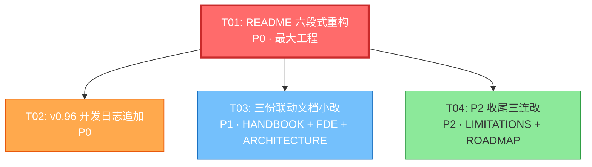

# sofagent v0.96 README 重构 + AI 中台叙事贯通 — 架构设计文档

> 架构师：高见远（Bob）  
> 产出性质：任务规格（工程师直接执行，不含正文写作）

---

## Part A: 文件清单

### 1. 涉及文件总览

| # | 文件 | 操作 | 改什么 | 行数变化 | 对应需求 |
|---|------|------|--------|---------|---------|
| 1 | `README.md` | 重构 | 373 行 → ≤200 行，六段式重组 | -173 行 | P0-1, P0-2, P0-3 |
| 2 | `HANDBOOK.md` | 小改 | 加 AI 中台背景段（精简 FAQ 腾空间） | 净增 ~30 行 | P1-1 |
| 3 | `sofagent-fde/SKILL.md` | 小改 | §一 进场话术加 AI 中台切入 | 净增 ~15 行 | P1-2 |
| 4 | `ARCHITECTURE.md` | 小改 | FDE 段落加 AI 中台三难对应 | 净增 ~20 行 | P1-3 |
| 5 | `docs/changelog/v0.96.md` | 追加 | 加 README 重构 + AI 中台贯通章节 | +~40 行 | P0-3 |
| 6 | `docs/EVIDENCE.md` | 无需改 | 已存在，README 引用即可 | — | P2-1 |
| 7 | `LIMITATIONS.md` | 小改 | 接收 README 移出的平台能力表内容 | +~20 行 | P2-2 |
| 8 | `ROADMAP.md` | 小改 | v0.96 条目标题更新 | ~5 行替换 | P2-3 |

---

## Part B: 任务分解

### 2. Required Packages

本项目为纯 Markdown 文档重构，**零第三方包依赖**。工程师只需文本编辑器 + `wc -l` 验证行数。

---

### 3. 共享知识（跨文件约定）

#### 3.1 AI 中台三难标准表述

> **三难**：AI 中台落地存在三个核心困难——① **接入难**（企业各系统 API 不统一，Agent 节点怎么接）② **信任难**（Agent 改了代码/数据，老板凭什么信）③ **沉淀难**（FDE 走了，经验跟着走了，企业自己管不住）

**sofagent 对应解法**：
- 接入难 → FDE 十步流程梳理工作流，MCP server 桥接企业平台
- 信任难 → git diff 审计层（sofagent-audit），确定性 exit code
- 沉淀难 → think.md 反思区 + task/logs 经验沉淀，知识库固化

**标准一句话**：「sofagent 是 AI 中台的纪律底座——接得进、信得过、留得住。」

#### 3.2 纪律底座标准定位句

> sofagent 不是 Agent 框架、不是 Skills 商店、不是运维工具。它是**一套跨平台 Agent 纪律标准**——给设备上的 Agent 配一个纪律委员，让它守规矩、留痕迹、能复盘。

**首屏定位句（~5 行）**：
```
sofagent 给你的 Agent 配一个设备端纪律委员。
不是让它更聪明，是让它守规矩——先读后写、验证再干、踩过的坑记下来。
4 底线 + 6 铁律约束行为，git diff 审计兜底验证，FDE 走了企业也能管住 Agent。
```

#### 3.3 文档间交叉引用链接格式

| 引用方向 | 链接格式 |
|---------|---------|
| README → EVIDENCE | `[效果证据](./docs/EVIDENCE.md)` |
| README → LIMITATIONS | `[平台能力与局限](./LIMITATIONS.md#平台依赖)` |
| README → ARCHITECTURE | `[架构设计](./ARCHITECTURE.md)` |
| README → HANDBOOK | `[使用手册](./HANDBOOK.md)` |
| README → DEVELOPMENT | `[开发文档](./DEVELOPMENT.md)` |
| README → v0.96 日志 | `[v0.96 开发日志](./docs/changelog/v0.96.md)` |
| README → FDE Skill | `[FDE 十步部署](./sofagent-fde/SKILL.md)` |

**底部延伸阅读区表格格式**：

```markdown
## 延伸阅读

| 你想了解 | 看哪里 |
|---------|--------|
| 怎么装、怎么用、什么是铁律 | [HANDBOOK.md](./HANDBOOK.md) |
| 为什么这么设计、已知局限 | [ARCHITECTURE.md](./ARCHITECTURE.md) |
| Skill 怎么协同、编排怎么跑 | [DEVELOPMENT.md](./DEVELOPMENT.md) |
| 企业落地三阶段指南 | [docs/team-deploy.md](./docs/team-deploy.md) |
| 实际效果数据 | [EVIDENCE.md](./docs/EVIDENCE.md) |
| 平台能力与已知局限 | [LIMITATIONS.md](./LIMITATIONS.md) |
| 版本路线图 | [ROADMAP.md](./ROADMAP.md) |
```

#### 3.4 README 六段式目标结构（≤200 行）

| 段 | 标题 | 目标行数 | 内容要点 |
|----|------|---------|---------|
| ① | 一句话定位 | ~5 行 | AI 中台纪律底座 + 三句话核心价值 |
| ② | 给三类人 | ~10 行表格 | 企业老板 / FDE / 开发者 各一行 |
| ③ | Quick Start | ~50 行 | lite 安装 + 完整安装 + smoke test + 跑第一个任务 |
| ④ | 怎么工作 | ~30 行 | 三层地基 + 引擎 + 一张 ASCII 架构图 |
| ⑤ | FDE 场景 + AI 中台 | ~20 行 | 三难对接叙事 |
| ⑥ | 技术细节折叠区 | ~5 行链接 | 延伸阅读表格（含原三份文档导航移到此处） |

**结构外保留**（不计入六段）：Header badges（~12 行）、许可证/署名（~6 行）、致谢（~10 行）≈ 28 行

**总预算**：28（固定头尾）+ 120（六段内容）+ 52（段落分隔/空行/badge）= **≤200 行**

---

### 4. 任务列表（有序 + 依赖关系）

#### T01: README 六段式重构（P0 核心）

**文件**：`README.md`  
**依赖**：无（最大工程，先做）  
**优先级**：P0

**具体操作**：

**删除**：
- 第 40-42 行：v0.85 定位校准段（整段删除）
- 第 44-53 行：效果证据状态表格（移至 EVIDENCE.md，README 改为一句话引用）
- 第 65-73 行：原「三份文档」表格（移到底部延伸阅读区）
- 第 87-104 行：概念分层两列表格（太细，移至 HANDBOOK 或直接删——README 不需要）
- 第 112-131 行：架构总览 ASCII 图区（精简，保留一张图）
- 第 137-152 行：平台能力整段（移至 LIMITATIONS.md，README 保留一句引用）
- 第 153-157 行：实际效果段（改为一句引用 EVIDENCE.md）
- 第 160-185 行：「新方向：提交时审计」整段（精简为 §⑤ 或 §⑥ 中的一句话链接）
- 第 188-208 行：「给部署者」整段（核心内容移入 §⑤ FDE 场景，安装命令移入 §③）
- 第 212-217 行：「不是什么」段（精简为 2-3 行，放在 §① 下方）
- 第 327-339 行：项目结构段（精简为一句或移入延伸阅读）
- 第 342-349 行：用了哪些外部项目（精简为致谢区一句）
- 第 353-358 行：贡献段（精简为一行链接）

**重组为六段式**：

```
[Header badges + 许可证/署名 — 保留现有 ~18 行]

## 一句话定位（新写 ~5 行）
- AI 中台纪律底座
- 三句话：守规矩 / 留痕迹 / 能复盘
- 删除：原 v0.85 校准、治理层 vs 模型引子（太长）

### 不是什么（精简 ~3 行，原第 212-217 行压缩）
- ❌ 不是框架/不写 prompt
- ❌ 不是 Skills 商店
- ✅ 是跨平台纪律标准

## 给三类人（~10 行表格）
| 你是谁 | 怎么用 sofagent |
|--------|---------------|
| 企业老板 | 不用看——FDE 交付方案书和运行报告，你只看结果 |
| FDE / 企业 IT | 十步标准化部署，装纪律底座 + 审计工具 |
| 开发者 | 30 秒 Lite 装宪法层，或完整安装跑编排引擎 |

## Quick Start（~50 行 — 从原第 220 行提到前 1/4）
[保留现有第 220-320 行的核心内容，但压缩]
- 快速体验（Lite，30 秒）—— 保留 clawhub/skillhub/git clone 三条命令
- 完整安装（两步）—— 保留 git clone + install.sh
- 30 秒 smoke test —— 保留 verify.sh
- 跑第一个任务 —— 保留 /goal 示例 + ls .sofagent/
- 删除：前置依赖表（移到 HANDBOOK §五）、平台安装表（移到 LIMITATIONS）
- 精简：各段提示语压缩到一句话

## 怎么工作（~30 行）
[保留现有第 76-131 行的精华，大幅压缩]
- 三行表：地基 / 引擎 / 进化
- 一张精简 ASCII 图（从原架构总览压缩）
- 删除：概念分层表、Token 预算段落（移到 HANDBOOK）、已知局限提示（移到 LIMITATIONS）
- 保留一句话：「厚在治理，薄在复用」

## FDE 场景 + AI 中台（~20 行 — 核心叙事新增）
[合并原第 35 行 FDE 场景 + 第 188-208 行给部署者 + AI 中台三难]
- AI 中台三难：接入难 / 信任难 / 沉淀难
- sofagent 对应解法表（3 行）
- FDE 十步部署一句话 + 链接到 sofagent-fde/SKILL.md
- 审计工具一句话 + 代码块示例

## 技术细节（~5 行折叠区）
### 延伸阅读
[原「三份文档」表格移到这里，扩展为 7 行表格]
```

**行数预算检查**：
- Header/badges/署名：~18 行
- §① 一句话定位 + 不是什么：~10 行
- §② 给三类人：~12 行
- §③ Quick Start：~55 行
- §④ 怎么工作：~32 行
- §⑤ FDE + AI 中台：~22 行
- §⑥ 延伸阅读：~15 行
- 贡献 + 致谢：~20 行
- 段落空行/分隔：~16 行
- **合计：~200 行** ✓

---

#### T02: v0.96 开发日志追加（P0）

**文件**：`docs/changelog/v0.96.md`  
**依赖**：T01（README 重构完成后记录）  
**优先级**：P0

**具体操作**：

在现有文件（240 行）**末尾追加新章节**（不新建文件）：

**新增章节**（追加在 §七 发布检查清单之前，或之后新增 §八）：

```markdown
## 八、README 重构 + AI 中台叙事贯通（新增 P0）

### README 六段式重构

v0.95 的 README 有 373 行——新用户打开就关。v0.96 重构为六段式 ≤200 行：

| 段 | 内容 | 目标行数 |
|----|------|---------|
| ① 一句话定位 | AI 中台纪律底座 + 三句话核心价值 | ~5 |
| ② 给三类人 | 企业老板 / FDE / 开发者 | ~10 |
| ③ Quick Start | 从第 220 行提到前 1/4 | ~50 |
| ④ 怎么工作 | 精简三层 + 一张图 | ~30 |
| ⑤ FDE 场景 + AI 中台 | 三难对接叙事 | ~20 |
| ⑥ 延伸阅读 | 三份文档导航移到底部 | ~5 |

**删除决策**：
- v0.85 定位校准段 → 直接删除（历史包袱，不再需要）
- 效果证据表 → 移至 EVIDENCE.md（README 一句话引用）
- 平台能力表 → 移至 LIMITATIONS.md
- 概念分层表 → 删除（太细，HANDBOOK 已有）

### AI 中台叙事贯通

v0.96 首次在文档体系中贯通「AI 中台纪律底座」定位：

- README §① 首屏即点明 AI 中台定位
- README §⑤ 三难对接（接入难 / 信任难 / 沉淀难）
- HANDBOOK 加 AI 中台背景段
- sofagent-fde §一 进场话术加 AI 中台切入
- ARCHITECTURE FDE 段加三难对应
```

同时在 §七 发布检查清单中追加：

```markdown
### README + AI 中台
- [ ] README ≤200 行（wc -l 验证）
- [ ] README 六段式结构完整
- [ ] AI 中台三难叙事贯通 README §① §⑤
- [ ] HANDBOOK AI 中台背景段写入
- [ ] sofagent-fde §一 AI 中台切入写入
- [ ] ARCHITECTURE FDE 段三难对应写入
```

---

#### T03: 三份联动文档小改（P1）

**文件**：`HANDBOOK.md` + `sofagent-fde/SKILL.md` + `ARCHITECTURE.md`  
**依赖**：T01（README 重构后的叙事框架作为基准）  
**优先级**：P1

**T03a: HANDBOOK.md — 加 AI 中台背景段**

当前行数：490 行。加 ~30 行后约 520 行。需精简 FAQ 腾出空间。

操作：
1. **精简 FAQ（第 388-403 行）**：
   - 删除第 400 行企业部署 FAQ（移至 sofagent-fde 已有更详细版本）
   - 删除第 401 行 Loop Engineering 自检 FAQ（与 ARCHITECTURE 重复）
   - 精简第 392-399 行每条答案为更短表述
   - 目标：腾出 ~20 行空间

2. **新增 AI 中台背景段**：
   - 位置：§一「厚在治理，薄在复用」之后，§二之前（约第 97 行）
   - 内容：

```markdown
### AI 中台的纪律底座

企业搭 AI 中台，卡在三件事上：

| 难 | 卡在哪 | sofagent 怎么解 |
|----|--------|---------------|
| 接入难 | 各系统 API 不统一，Agent 节点怎么接 | FDE 十步梳理工作流，MCP 桥接平台 |
| 信任难 | Agent 改了代码数据，老板凭什么信 | git diff 审计，确定性 exit code |
| 沉淀难 | FDE 走了经验跟着走 | think.md 反思 + task/logs 沉淀 |

sofagent 不做 AI 中台——做 AI 中台里**纪律那一层**。模型管推理，平台管调度，sofagent 管纪律。
```

**T03b: sofagent-fde/SKILL.md — §一 进场话术加 AI 中台切入**

当前行数：353 行。

操作：
1. 在 §一「进场：确定场景」（第 24-40 行）开头，**现有的角色描述之后**（第 18-20 行的 `> 你的角色` 和 `> 范围声明` 之间），新增 AI 中台切入说明：

```markdown
> **AI 中台切入**：你进入的企业正在搭 AI 中台——Agent 接入了，但没人管。接入难、信任难、沉淀难，三个坑都在等你。你的工作是：用十步流程把工作流梳理清楚（解接入难），用 sofagent 审计让 Agent 改动可验证（解信任难），用知识库把经验固化在企业（解沉淀难）。sofagent 是你手里的纪律底座——不是 AI 中台本身。
```

2. 不改其他章节结构。

**T03c: ARCHITECTURE.md — FDE 段加三难对应**

当前行数：417 行。

操作：
1. 在 `<a id="fde-architecture"></a>` 「产品架构展望（五层）」段（第 49-64 行）之后，新增 AI 中台三难对应子节：

```markdown
### AI 中台三难与 sofagent 五层对应

| AI 中台三难 | sofagent 对应层 | 怎么解 |
|------------|----------------|--------|
| 接入难 | 执行层 + MCP 推送层（规划中） | daemon 常驻 + MCP server 桥接企业平台 |
| 信任难 | 审计层 | git diff 确定性审计，exit code 可集成 CI |
| 沉淀难 | 纪律层（反思区 + task/logs） | 经验在文件系统，FDE 走了不带走 |

sofagent 不替代 AI 中台——它是 AI 中台里 Agent 治理那一层的纪律底座。模型层、编排层、基础设施层不在范围内。
```

---

#### T04: P2 收尾三连改（P2）

**文件**：`LIMITATIONS.md` + `ROADMAP.md`  
**依赖**：T01（README 重构移出的内容需要接收）  
**优先级**：P2

**T04a: LIMITATIONS.md — 接收 README 移出的平台能力表**

当前行数：286 行。

操作：
1. 在 `<a id="平台依赖"></a>` 「平台依赖」段（第 151-172 行），**现有平台能力表之后**，追加一段精简的「实际价值」说明（从 README 移出的核心信息）：

```markdown
### 平台实际价值速查

| 平台 | 核心约束 | 完整治理 | 实际价值 |
|------|:---:|:---:|:---:|
| OpenClaw | ✅ Hook 注入 | ✅ 编排+Hook+断路器 | ~100% |
| WorkBuddy | ✅ SKILL 加载 | ⚠️ 部分降级 | ~40% |
| Codex / Hermes / Claude Code | ⚠️ 种子指令 | ❌ 缺失 | ~30% |

> "兼容"不等于"支持"。核心约束（MD 文件）所有平台可读，完整治理只在 OpenClaw 上生效。
```

**T04b: ROADMAP.md — v0.96 条目标题更新**

操作：
1. 更新第 1 行版本号摘要：`v0.95` → `v0.96`（或追加 v0.96 描述）
2. 在 `## 现在在哪` 段（第 21-33 行）之后或之前，新增 v0.96 条目：

```markdown
## 现在在哪：v0.96

> v0.96 是 **README 重构 + AI 中台叙事贯通版本**。核心改动：README 从 373 行重构为 ≤200 行六段式 + AI 中台纪律底座定位首次贯通文档体系 + 审计闭环六步设计。详见 [v0.96 开发日志](./docs/changelog/v0.96.md)。

| 级别 | 交付 | 状态 |
|------|------|:----:|
| P0 | README 六段式重构（373→≤200 行）+ AI 中台叙事贯通 | 🔄 |
| P1 | HANDBOOK AI 中台背景 + FDE Skill 进场切入 + ARCHITECTURE 三难对应 | 🔄 |
| P2 | 平台能力表移至 LIMITATIONS + ROADMAP v0.96 标题更新 | 🔄 |
```

3. 将原 v0.95 条目下移为历史记录。

**注**：T04 的 EVIDENCE.md 确认已存在（第 1-87 行），README 只需引用，无需修改 EVIDENCE 本身。

---

### 5. 任务依赖图



**依赖说明**：
- T01 是最大工程且定义了 AI 中台叙事框架，T02/T03/T04 都依赖 T01 完成后的叙事基准
- T02 记录 T01 的改动结果
- T03 联动文档引用 T01 中确立的三难表述和定位句
- T04 接收 T01 从 README 移出的内容
- T02、T03、T04 之间无依赖，**可并行执行**

---

### 6. 执行顺序建议

| 顺序 | 任务 | 预估工时 | 说明 |
|:----:|------|---------|------|
| 1 | T01 | 2-3 小时 | 最大工程，六段式重组，需要反复 `wc -l` 验证 |
| 2 | T02 + T03 + T04 并行 | 1-1.5 小时 | 三个小改任务，依赖 T01 完成的叙事框架 |
| 总计 | | 3-4.5 小时 | |

---

## Part C: 待明确事项

### 7. UNCLEAR

1. **README 英文版同步**：`README.en.md` 是否需要同步重构？当前任务范围未提及。**假设**：本期只改中文版，英文版后续版本同步。

2. **Quick Start 中的前置依赖表**：原 README 第 263-273 行有完整的前置依赖表（bash/git/node/npm 版本要求）。重构后移到哪里？**建议**：移至 HANDBOOK §五（安装与跨平台），README 只保留「需要 bash 4+ 和 git」一句话。

3. **AI 中台三难的措辞**：PRD §3⑤ 的摘要由主理人提供，但三难（接入难/信任难/沉淀难）的具体措辞可能需要和产品经理确认是否与 PRD 完全一致。**假设**：按本设计文档中的标准表述执行，QA 阶段校验。

4. **CHANGELOG.md 索引**：v0.96.md 的发布检查清单提到「CHANGELOG.md 索引添加 v0.96 条目」，但任务清单未包含。**假设**：由工程师在执行 T02 时一并处理，或在 QA 阶段补。

5. **HANDBOOK 精简 FAQ 的具体条目**：第 400-401 行的两条 FAQ 建议删除，但需要确认这些信息在其他文档中已有覆盖。**已确认**：企业部署 FAQ 在 sofagent-fde/SKILL.md 有更详细版本；Loop Engineering 自检在 ARCHITECTURE.md §五参考与致谢有引用。

---

## 附录：README 六段式结构对照表

| 当前 README 章节 | 行范围 | 新结构归属 | 操作 |
|-----------------|--------|----------|------|
| Header + badges | 1-25 | 保留 | 精简 badge 行数 |
| 这是什么 | 27-61 | §① 一句话定位 | 大幅压缩，保留核心句 |
| — | — | 不是什么（新） | 从第 212-217 行移入，精简为 3 行 |
| 三份文档 | 65-73 | §⑥ 延伸阅读 | 移到底部，扩展为 7 行 |
| 怎么工作 | 76-104 | §④ 怎么工作 | 保留三行表 + 一图，删概念分层 |
| FDE 场景 | 106-110 | §⑤ FDE + AI 中台 | 合并扩展 |
| 架构总览 | 112-135 | §④ 怎么工作 | 压缩为一张图 |
| 平台能力 | 137-152 | 移至 LIMITATIONS | README 改为一句话引用 |
| 实际效果 | 153-157 | 删 | 改为 §⑥ 引用 EVIDENCE.md |
| 新方向：提交时审计 | 160-185 | §⑤ 或 §⑥ | 压缩为一句话 + 链接 |
| 给部署者 | 188-208 | §③ + §⑤ | 拆分：安装命令入 §③，叙事入 §⑤ |
| 不是什么 | 212-217 | §① 下方 | 精简为 3 行 |
| Quick Start | 220-320 | §③ Quick Start | 提到前 1/4，压缩提示语 |
| 项目结构 | 327-339 | §⑥ 或删 | 精简为一句 |
| 外部项目 | 342-349 | 致谢区 | 精简 |
| 贡献 | 353-358 | 保留 | 精简为一行 + 链接 |
| 致谢 | 361-373 | 保留 | 精简 |
